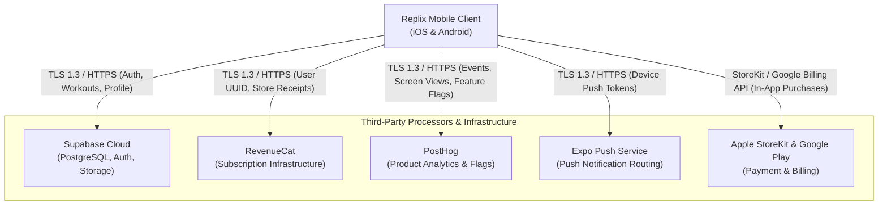

# App Store & Google Play Data Safety Questionnaire & Disclosure Guide

**Document Version:** 1.0.0  
**Effective Date:** September 17, 2026  
**Application Name:** Replix  
**Bundle ID (iOS):** `com.skortan.replix`  
**Application ID (Android):** `com.skortan.replix`  
**Publisher / Developer:** Skortan / Replix Engineering Team  
**Primary Contact:** [privacy@replix.fit](mailto:privacy@replix.fit) | [legal@replix.fit](mailto:legal@replix.fit)

---

## Executive Overview

This document provides a verified, audit-ready data inventory and disclosure guide for the **Replix** mobile application. It is specifically formulated to assist engineering and release teams in accurately completing:
1. **Apple App Store Connect:** App Privacy Nutrition Labels.
2. **Google Play Console:** Data Safety Form.

> [!IMPORTANT]
> **Audit Guarantee:** The disclosures in this document are derived from an unrestricted, static code analysis of the entire Replix codebase, including native CameraX/MediaPipe modules (`modules/pose-landmarker`), Supabase PostgreSQL database schemas (`20260313000001_remote_schema.sql`), RevenueCat SDK integration (`premiumService.ts`), and PostHog telemetry (`analyticsService.ts`).

---

## 1. Ephemeral vs. Stored Data: Camera & MediaPipe AI Processing (CRITICAL DISCLOSURE)

Store reviewers heavily scrutinize apps utilizing the device camera and computer vision models. The following declarations must be maintained across all store submissions:

```
┌────────────────────────────────────────────────────────────────────────────────────────┐
│                   ON-DEVICE VISION PIPELINE: EPHEMERALITY GUARANTEE                    │
├────────────────────────────────────────────────────────────────────────────────────────┤
│ 1. 100% ON-DEVICE PROCESSING: Camera feed frames are analyzed in-memory exclusively    │
│    on the local device CPU/GPU delegate via Google MediaPipe Tasks Vision.            │
│                                                                                        │
│ 2. INSTANT FRAME DISPOSAL (< 33ms): Frame buffers (`ImageProxy`) are explicitly       │
│    closed and recycled in the `finally {}` block immediately after landmark inference. │
│                                                                                        │
│ 3. ZERO IMAGE STORAGE: No camera images, video streams, or raw photos are ever saved  │
│    to local persistent storage, cache directories, or photo galleries.                 │
│                                                                                        │
│ 4. ZERO CLOUD TRANSMISSION: Zero camera bytes or video streams are transmitted to      │
│    Supabase, RevenueCat, PostHog, or any remote server over the network.              │
│                                                                                        │
│ 5. DISCARDED SKELETAL LANDMARKS: The 33 3D skeletal landmark coordinates (X, Y, Z)     │
│    are evaluated in volatile JavaScript RAM by `PoseService.ts` to compute rep counts │
│    and joint angles. The raw coordinates are discarded immediately after calculation.  │
└────────────────────────────────────────────────────────────────────────────────────────┘
```

### Technical Proof Points from Codebase:
- **Frame Lifecycle (`PoseLandmarkerView.kt`)**: The camera analyzer uses `ImageAnalysis.STRATEGY_KEEP_ONLY_LATEST` with output `OUTPUT_IMAGE_FORMAT_RGBA_8888`. Frame processing executes `poseLandmarker?.detectAsync(mpImage, frameTime)` and executes `imageProxy.close()` inside the `finally` block (lines 241–293).
- **Network Isolation**: The native module `modules/pose-landmarker` contains **zero network dependencies** and no socket/HTTP clients.
- **Database Persistence**: The Supabase `workouts` table stores **only scalar workout results** (`exercise_type`, `total_reps`, `duration`, `accuracy_score`, `calories_burned`), never raw video or coordinates.

---

## 2. Comprehensive Data Inventory & Collection Purpose

The table below catalogs every piece of user data handled by Replix, cross-referenced with backend tables and third-party SDKs:

| Data Type | Specific Fields | Storage Location | Processing Purpose | Linked to User? | Used for Tracking? |
| :--- | :--- | :--- | :--- | :--- | :--- |
| **Contact Info** | Email address (`email`) | Supabase `auth.users`, `profiles` | Account authentication, OTP login verification, transactional communications, customer support | **Yes** | **No** |
| **Name** | Full Name (`full_name`), Username (`username`) | Supabase `profiles` | App functionality, user profile, social leaderboards, friend identification | **Yes** | **No** |
| **User Identifiers** | Supabase User ID (`UUID`), RevenueCat App User ID | Supabase, RevenueCat, PostHog | App functionality, user account mapping, subscription entitlement validation, analytics | **Yes** | **No** |
| **Device & Push Identifiers** | Expo Push Token (`expo_push_token`), Device OS | Supabase `user_devices` | App functionality, delivering workout reminders, streak notifications, friend alerts | **Yes** | **No** |
| **Purchases & Financial** | Subscription status, active tier (`monthly`/`annual`), expiration date, transaction timestamps | Supabase `subscriptions`, RevenueCat, Apple StoreKit, Google Play Billing | App functionality, unlocking Pro features, auto-renewal validation. *(Note: Credit card info is processed exclusively by Apple/Google)* | **Yes** | **No** |
| **Health & Fitness** | Rep counts, workout duration, form accuracy score, calories burned, personal records, streak counts, XP | Supabase `workouts`, `user_streaks`, `personal_records`, `xp_transactions` | Core app functionality, progress analytics, gamification badges, global/friend leaderboards | **Yes** | **No** |
| **Physical & Body Stats** *(Optional)* | Height, weight, age, biological gender, experience level, workout frequency | Supabase `profiles` | Workout personalization, calorie expenditure estimation, rep difficulty scaling | **Yes** | **No** |
| **User Content / Media** | Profile Avatar URL (`avatar_url`) | Supabase Storage (`avatars` bucket) | App functionality, user profile customization | **Yes** | **No** |
| **Social / Relationships** | Friend connections (`friends`), friend request status (`pending`/`accepted`) | Supabase `friends` | Social features, friend workouts, peer leaderboards | **Yes** | **No** |
| **App Interactions & Usage** | Screen views, feature interactions, workout completion events | PostHog Analytics, PostHog Feature Flags | Product analytics, bug diagnosis, feature experimentation, performance optimization | **Yes** | **No** |
| **Crash & Diagnostics** | App version, OS version, device model, error logs | PostHog, Expo Insights, local logs | App reliability, debugging, crash remediation | **No** (Aggregated) | **No** |
| **Camera / Video Feed** | Live camera video frames | **None** *(Volatile RAM only, discarded <33ms)* | Real-time on-device pose estimation and form coaching | **No** *(Ephemeral)* | **No** |

---

## 3. Third-Party SDK & Data Sharing Disclosures

Every third-party SDK integrated into the application has been analyzed for external data transmission:



### Detailed SDK Data Mapping:
1. **Supabase (`@supabase/supabase-js`)**:
   - **Data Shared:** User email, hashed passwords/OTP sessions, profile metadata, body statistics, workout records, social connections, push tokens.
   - **Role:** Primary cloud database, identity provider, and file storage.
   - **Data Security:** Data transmitted via TLS 1.3/HTTPS, stored in AES-256 encrypted PostgreSQL tables protected by Row Level Security (RLS).
2. **RevenueCat (`react-native-purchases`)**:
   - **Data Shared:** Supabase User ID (`Purchases.logIn(userId)`), platform purchase receipts, product identifiers (`replix_monthly`, `replix_annual`), subscription expiry timestamps.
   - **Role:** Receipt validation and cross-platform entitlement management.
   - **Data Security:** Transmitted via HTTPS; does not receive credit card or billing address data.
3. **PostHog (`posthog-react-native`)**:
   - **Data Shared:** User ID (or anonymous session ID), app lifecycle events (e.g., `workout_completed`, `tier_selected`), device model, OS version.
   - **Role:** Feature flag delivery, product analytics, and UX improvement.
   - **Data Privacy:** Users can opt out via `analyticsService.setOptOut(true)`.
4. **Expo Notifications (`expo-notifications`)**:
   - **Data Shared:** Device Push Token (`ExponentPushToken[...]`), device operating system.
   - **Role:** Delivering transactional notifications (streak reminders, morning reports, friend notifications).
5. **Apple StoreKit & Google Play Billing**:
   - **Data Shared:** Payment credentials, billing details, credit card numbers.
   - **Role:** Financial transactions and tax processing. Replix **never** sees or stores raw payment instrument data.

---

## 4. Data Security, Retention, & Deletion

### 4.1 Data Encryption
- **Data in Transit:** 100% of network traffic between the Replix mobile app and cloud servers (Supabase, RevenueCat, PostHog, Expo) is encrypted using **TLS 1.3 / TLS 1.2 (HTTPS/WSS)**.
- **Data at Rest:** All backend database volumes and storage buckets in Supabase are encrypted using industry-standard **AES-256**.
- **On-Device Storage:** Authentication tokens (JWTs) and refresh tokens are stored locally via `AsyncStorage` / Secure Keystore using the PKCE authentication flow.

### 4.2 Data Deletion Mechanism (Store Requirement)
Both Apple (Guideline 5.1.1(v)) and Google (Data Deletion Policy) mandate an in-app data deletion mechanism:
- **In-App Self-Serve Deletion:** Users can permanently delete their account and all associated data directly in the app at **Profile > Settings > Account > Delete Account**.
- **Cascading Database Purge:** Deleting an account initiates a cascading purge across all database tables:
  - `profiles`
  - `workouts`
  - `subscriptions`
  - `user_devices`
  - `friends`
  - `user_achievements`
  - `xp_transactions`
  - `user_trophies`
  - `user_streaks`
  - `personal_records`
  - Supabase Storage `avatars` bucket (avatar image files)
- **External Deletion Requests:** Users may also request full account and data deletion by emailing [privacy@replix.fit](mailto:privacy@replix.fit). Manual deletion requests are completed within **30 days**.

---

## 5. Apple App Store Connect: App Privacy Configuration Guide

Use this section to complete the **App Privacy** questionnaire in App Store Connect:

### Question: "Do you or your third-party partners collect data from this app?"
- **Answer:** **Yes**

### Question: "Is any data collected used for tracking purposes?"
- **Answer:** **No** *(Replix does not link user data with third-party data for targeted advertising).*

---

### App Store Privacy Data Types Matrix:

```
┌──────────────────────────────────────────────────────────────────────────────────────────────────────────────────┐
│                                  APPLE APP STORE CONNECT PRIVACY DECLARATION                                     │
├──────────────────────────┬─────────────────────────────┬────────────────────────┬─────────────────┬──────────────┤
│ Data Category            │ Specific Data Type          │ Collection Purposes    │ Linked to User? │ Tracking?    │
├──────────────────────────┼─────────────────────────────┼────────────────────────┼─────────────────┼──────────────┤
│ Contact Info             │ Email Address               │ • App Functionality    │ YES             │ NO           │
│                          │                             │ • Account Management   │                 │              │
├──────────────────────────┼─────────────────────────────┼────────────────────────┼─────────────────┼──────────────┤
│ Contact Info             │ Name                        │ • App Functionality    │ YES             │ NO           │
│                          │                             │ • Account Management   │                 │              │
├──────────────────────────┼─────────────────────────────┼────────────────────────┼─────────────────┼──────────────┤
│ Health & Fitness         │ Fitness                     │ • App Functionality    │ YES             │ NO           │
│                          │ (Reps, Workouts, Accuracy)  │ • Analytics            │                 │              │
├──────────────────────────┼─────────────────────────────┼────────────────────────┼─────────────────┼──────────────┤
│ Financial Info           │ Purchase History            │ • App Functionality    │ YES             │ NO           │
├──────────────────────────┼─────────────────────────────┼────────────────────────┼─────────────────┼──────────────┤
│ Identifiers              │ User ID (Supabase / RC)     │ • App Functionality    │ YES             │ NO           │
│                          │ Device ID (Push Token)      │ • Analytics            │                 │              │
├──────────────────────────┼─────────────────────────────┼────────────────────────┼─────────────────┼──────────────┤
│ Usage Data               │ Product Interaction         │ • Analytics            │ YES             │ NO           │
│                          │ (Workouts, Screen Views)    │ • App Functionality    │                 │              │
├──────────────────────────┼─────────────────────────────┼────────────────────────┼─────────────────┼──────────────┤
│ Diagnostics              │ Crash Data / Performance    │ • App Functionality    │ NO              │ NO           │
│                          │                             │ • Analytics            │                 │              │
├──────────────────────────┼─────────────────────────────┼────────────────────────┼─────────────────┼──────────────┤
│ Photos or Videos         │ Photos (Profile Avatar)     │ • App Functionality    │ YES             │ NO           │
│                          │ Camera Stream (Ephemeral)   │ • NOT COLLECTED        │ N/A             │ NO           │
└──────────────────────────┴─────────────────────────────┴────────────────────────┴─────────────────┴──────────────┘
```

> [!CAUTION]
> **Camera Disclosure for App Store Reviewers:** When asked if camera data is collected, declare **"No, camera frames are processed purely on-device in real-time and are never collected, stored, or transmitted to any server."**

---

## 6. Google Play Console: Data Safety Form Configuration Guide

Use this section to complete the **Data Safety** questionnaire in Google Play Console:

### 6.1 General Declarations:
- **Does your app collect or share any of the required user data types?** -> **Yes**
- **Is all of the user data collected by your app encrypted in transit?** -> **Yes**
- **Do you provide a way for users to request that their data be deleted?** -> **Yes**
- **Deletion URL:** `https://replix.fit/delete-account` (or email [privacy@replix.fit](mailto:privacy@replix.fit))

---

### 6.2 Data Types & Purpose Checklist (Google Play):

#### 1. Personal Info
- **Name:**
  - Collected: **Yes** | Shared: **No**
  - Ephemeral: **No** | Required: **Yes**
  - Purpose: **App functionality, Account management**
- **Email address:**
  - Collected: **Yes** | Shared: **No**
  - Ephemeral: **No** | Required: **Yes**
  - Purpose: **App functionality, Account management, Developer communications**
- **User IDs:**
  - Collected: **Yes** | Shared: **Yes** *(Shared with RevenueCat & PostHog for functionality & analytics)*
  - Ephemeral: **No** | Required: **Yes**
  - Purpose: **App functionality, Analytics, Account management**

#### 2. Financial Info
- **Purchase history:**
  - Collected: **Yes** | Shared: **Yes** *(Shared with RevenueCat)*
  - Ephemeral: **No** | Required: **Yes**
  - Purpose: **App functionality, Account management**

#### 3. Health and Fitness
- **Fitness info (Workout history, Repetitions, Accuracy, Body measurements):**
  - Collected: **Yes** | Shared: **No**
  - Ephemeral: **No** | Required: **Yes** (workout metrics) / **Optional** (body measurements)
  - Purpose: **App functionality, Personalization, Analytics**

#### 4. Photos and Videos
- **Photos (User Avatar):**
  - Collected: **Yes** | Shared: **No**
  - Ephemeral: **No** | Required: **No (Optional)**
  - Purpose: **App functionality (Account customization)**
- **Videos / Camera Feed:**
  - Collected: **No** *(Processed ephemerally in RAM, not collected)*

#### 5. App Activity
- **App interactions (Workouts logged, button clicks, screen navigation):**
  - Collected: **Yes** | Shared: **Yes** *(Shared with PostHog)*
  - Ephemeral: **No** | Required: **Yes**
  - Purpose: **Analytics, App functionality**

#### 6. App Info and Performance
- **Crash logs & Diagnostics:**
  - Collected: **Yes** | Shared: **Yes** *(Shared with PostHog / Expo)*
  - Ephemeral: **No** | Required: **Yes**
  - Purpose: **Analytics, Developer communications**

#### 7. Device or Other Identifiers
- **Device or other IDs (Expo Push Token, Device ID):**
  - Collected: **Yes** | Shared: **Yes** *(Shared with Expo Push Service)*
  - Ephemeral: **No** | Required: **Yes**
  - Purpose: **App functionality (Push notifications)**

---

## 7. Submission Checklist for Release Engineers

Before submitting a new build to App Store Connect or Google Play Console:

- [x] Confirm `pose_landmarker_lite.task` runs purely offline on the test device.
- [x] Verify no video recordings or camera snapshots are created in `FileSystem.documentDirectory` or `FileSystem.cacheDirectory`.
- [x] Verify TLS 1.3 encryption on all Supabase, RevenueCat, and PostHog endpoints.
- [x] Verify in-app **Delete Account** button executes the account deletion flow and returns the user to the welcome screen.
- [x] Ensure the published [Privacy Policy](file:///d:/rs/docs/legal-and-compliance/privacy-policy.md) URL matches the store listing URL.
- [x] Ensure the published [Terms of Service](file:///d:/rs/docs/legal-and-compliance/terms-of-service.md) URL is referenced in store EULA links.
