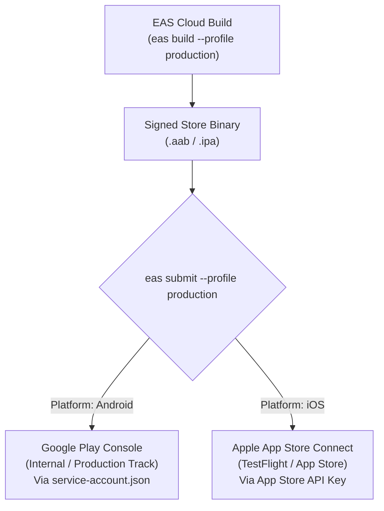

# Replix EAS Build & Deployment Operations Guide

**Document Version:** 1.0.0  
**Effective Date:** September 17, 2026  
**Application Name:** Replix  
**Package / Bundle Identifier:** `com.skortan.replix`  
**EAS Project ID:** `d2c0c3a5-97f2-4472-939d-b052e746f2e6`  
**EAS Owner:** `skortan`  
**Expo SDK Version:** `54.0.37` (New Architecture Enabled)  
**Required CLI Version:** `eas-cli >= 21.0.2`  

---

## 1. Executive Overview

This guide provides the complete operational blueprint for compiling, testing, updating, and submitting the **Replix** mobile application using **Expo Application Services (EAS)**.

Because Replix integrates a custom native C++/Kotlin camera module (`modules/pose-landmarker`) running Google MediaPipe Tasks Vision, **Expo Go cannot be used for development or testing**. All internal testing and releases must utilize custom EAS Dev Clients or standalone binary builds.

---

## 2. EAS Build Profiles Deep Dive ([`eas.json`](file:///d:/rs/eas.json))

The build configuration in `eas.json` defines three specialized deployment channels:

```
┌────────────────────────────────────────────────────────────────────────────────────────────────────────┐
│                                       EAS BUILD PROFILES                                               │
├─────────────────┬──────────────┬──────────────┬────────────────────────────────────────────────────────┤
│ Profile Name    │ Distribution │ Output Format│ Purpose & Operational Environment                      │
├─────────────────┼──────────────┼──────────────┼────────────────────────────────────────────────────────┤
│ **development** │ `internal`   │ Dev Client   │ Custom debug binary bundling `modules/pose-landmarker` │
│                 │              │ (`apk` / `ipa`)│ connects to local Metro bundler for live coding.       │
├─────────────────┼──────────────┼──────────────┼────────────────────────────────────────────────────────┤
│ **preview**     │ `internal`   │ Standalone   │ Internal QA build. Directly generates a standalone APK │
│                 │              │ `.apk` (Android)│ for side-loading on physical Android devices.          │
├─────────────────┼──────────────┼──────────────┼────────────────────────────────────────────────────────┤
│ **production**  │ `store`      │ `.aab` (Android) Store release binary with remote auto-incrementing    │
│                 │              │ `.ipa` (iOS) │ version codes, submitted directly to App Stores.       │
└─────────────────┴──────────────┴──────────────┴────────────────────────────────────────────────────────┘
```

### Profile Specifications:

#### 1. Development Profile (`development`)
```json
"development": {
  "developmentClient": true,
  "distribution": "internal",
  "channel": "development"
}
```
- Bundles `expo-dev-client` alongside native CameraX and MediaPipe GPU libraries.
- Allows developers to test real-time pose tracking locally while retaining hot reloading.

#### 2. Preview Profile (`preview`)
```json
"preview": {
  "distribution": "internal",
  "channel": "preview",
  "android": {
    "buildType": "apk"
  }
}
```
- Compiles a standalone `.apk` rather than an Android App Bundle (`.aab`).
- Bypasses Google Play Console for fast internal QA distribution via direct download link.

#### 3. Production Profile (`production`)
```json
"production": {
  "autoIncrement": true,
  "channel": "production"
}
```
- Compiles an optimized, signed release binary (`.aab` for Google Play and `.ipa` for TestFlight).
- Automatically increments `versionCode` and `buildNumber` on Expo's remote server prior to compilation.

---

## 3. Developer Build Commands

### 3.1 Initial Environment Authentication
```bash
# 1. Install or update EAS CLI
npm install -g eas-cli@latest

# 2. Authenticate with the Skortan Expo account
eas login

# 3. Verify project binding
eas whoami
```

---

### 3.2 Compiling Custom Development Clients
Run these commands when modifying native dependencies, `modules/pose-landmarker`, or `app.config.js` plugins:

```bash
# Build Android Custom Dev Client (generates APK installable on phone)
eas build --profile development --platform android

# Build iOS Custom Dev Client (requires registered Apple device UUID)
eas build --profile development --platform ios

# Build both platforms in parallel
eas build --profile development --platform all
```

---

### 3.3 Compiling QA Preview Builds
```bash
# Generate standalone Android APK for physical device side-loading
eas build --profile preview --platform android
```

---

### 3.4 Compiling Store-Ready Production Binaries
```bash
# Build production Android App Bundle (.aab)
eas build --profile production --platform android

# Build production iOS App Archive (.ipa)
eas build --profile production --platform ios

# Trigger full multi-platform release build
eas build --profile production --platform all
```

---

### 3.5 Local Native Compilation (Zero Cloud Queue)
For rapid local iteration on a physical Android device connected via USB with ADB:

```bash
# Prebuild and compile Android native project locally
npx expo run:android

# Prebuild and compile iOS native project locally (macOS only)
npx expo run:ios
```

---

## 4. Over-The-Air (OTA) Updates (`eas update`)

Replix is configured with EAS Update to push instant JavaScript and asset hotfixes without waiting for App Store or Google Play review.

### 4.1 OTA Configuration in [`app.config.js`](file:///d:/rs/app.config.js#L19-L25):
```javascript
updates: {
  url: "https://u.expo.dev/d2c0c3a5-97f2-4472-939d-b052e746f2e6",
},
runtimeVersion: {
  policy: "appVersion",
},
```

### 4.2 Dispatching OTA Updates:

```bash
# Push update to production users (instant hotfix)
eas update --channel production --message "Fix UI layout and analytics formatting"

# Push update to preview channel
eas update --channel preview --message "Test new quest XP calculations"
```

> [!CAUTION]
> **OTA Binary Compatibility Rule:** Because `runtimeVersion` uses the `appVersion` policy, OTA updates will **only** reach devices running the exact matching binary version (e.g. `1.0.0`). If you modify native Kotlin/C++ code in `modules/pose-landmarker` or add a new native npm dependency, you **MUST** bump `version` in `app.config.js` and compile new native binaries via `eas build`.

---

## 5. Store Submission Pipeline (`eas submit`)

Configured in `eas.json`:
```json
"submit": {
  "production": {}
}
```



### 5.1 Google Play Store Submission
- **API Key Configuration:** Uses [`service-account.json`](file:///d:/rs/service-account.json) located in the project root containing Google Cloud Service Account credentials authorized for the Google Play Developer API.
- **Submission Command:**
  ```bash
  eas submit --platform android --profile production
  ```

### 5.2 Apple App Store Connect / TestFlight Submission
- **API Key Configuration:** EAS securely prompts for or uses saved App Store Connect API Key (`Issuer ID`, `Key ID`, `.p8` file).
- **Submission Command:**
  ```bash
  eas submit --platform ios --profile production
  ```

---

## 6. Certificates & Keystore Management

### 6.1 Android Upload Keystore
- **Storage:** Managed securely in Expo Cloud (EAS Credentials service).
- **Format:** Android Java Keystore (`.jks`) automatically applied during remote cloud compilation.
- **Google Play App Signing:** Google Play re-signs the submitted `.aab` with Google's production signing key before delivering APKs to end-user devices.

### 6.2 iOS Certificates & Provisioning Profiles
- **Distribution Certificate:** Managed remotely by EAS Credentials under the Skortan Apple Developer Team.
- **Provisioning Profiles:** Auto-generated per build profile (`com.skortan.replix`).
- **Push Notification Key (`.p8`):** Stored in EAS Cloud to authorize Apple Push Notification Service (APNs) dispatch.

### 6.3 Viewing & Syncing Credentials Locally
```bash
# Manage and inspect keystores and provisioning profiles
eas credentials
```
