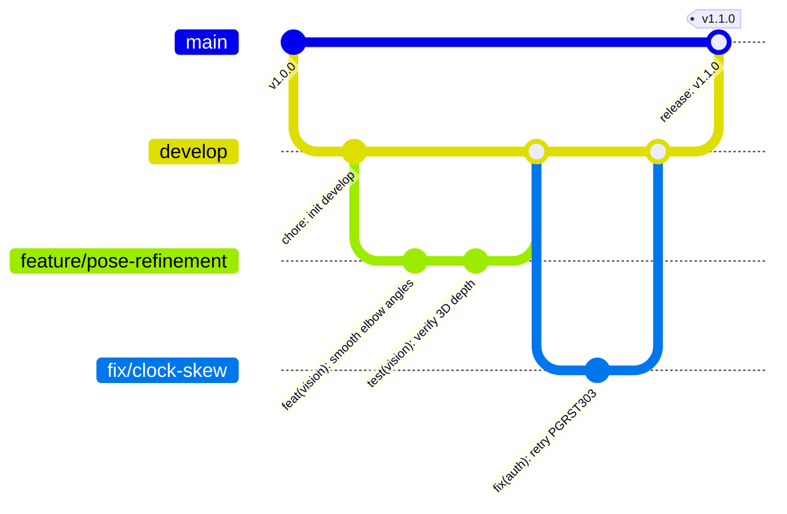
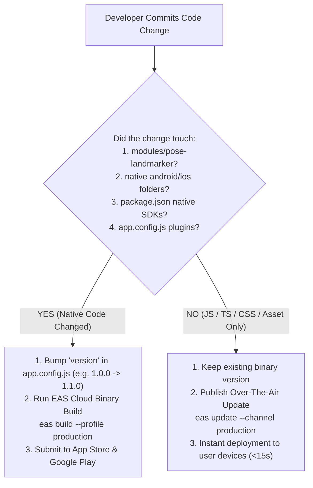

# Replix Git Workflow & Versioning Strategy

**Document Version:** 1.0.0  
**Effective Date:** September 17, 2026  
**Application:** Replix Mobile Application (`com.skortan.replix`)  
**EAS Project ID:** `d2c0c3a5-97f2-4472-939d-b052e746f2e6`  
**Repository Architecture:** Monorepo with Custom Native Expo Module (`modules/pose-landmarker`)  

---

## 1. Executive Summary

This document governs source code management, branching conventions, commit standards, quality assurance checkpoints, and versioning mechanics for the **Replix** repository.

Because Replix bundles custom native C++/Kotlin code for CameraX and Google MediaPipe GPU vision (`modules/pose-landmarker`), strict versioning and release discipline must be maintained to prevent runtime version mismatches during Over-The-Air (OTA) updates and store releases.

---

## 2. Branching Strategy



### 2.1 Branch Taxonomy
- **`main` (Production Branch):**
  - Represents the code currently deployed in the Apple App Store and Google Play Store production channels.
  - Direct commits and force-pushes are strictly forbidden.
  - Releases are tagged using semantic versioning (e.g. `v1.0.0`, `v1.1.0`).
- **`develop` (Integration / Staging Branch):**
  - Aggregates validated feature branches for integration testing.
  - Powers internal QA builds generated via `eas build --profile preview`.
- **Feature Branches (`feature/<feature-name>`):**
  - Branch off: `develop`
  - Merge into: `develop` (via Pull Request)
  - Example: `feature/audio-coach-tones`, `feature/quest-streak-freeze`
- **Bugfix Branches (`fix/<bug-name>`):**
  - Branch off: `develop` (or `main` for hotfixes)
  - Merge into: `develop` and `main`
  - Example: `fix/camera-rotation-matrix`, `fix/otp-autofill-lag`
- **Chore / Refactor Branches (`chore/<task>`, `refactor/<module>`):**
  - Example: `chore/expo-54-upgrade`, `refactor/history-store-caching`

---

## 3. Commit Message Conventions (Conventional Commits)

All commits should adhere to the **Conventional Commits 1.0.0** standard:

```
<type>(<scope>): <short description in present tense>

[optional body explaining rationale]

[optional footer with issue references]
```

### 3.1 Supported Commit Types:
- **`feat`**: New user-facing feature or enhancement.
  - *Example:* `feat(vision): implement 5-stage anti-cheat depth validation`
- **`fix`**: Bug fix in application or native module logic.
  - *Example:* `fix(auth): add global retry loop for PGRST303 clock-skew errors`
- **`perf`**: Performance optimization (memory, FPS, render loop).
  - *Example:* `perf(vision): pre-allocate Rect objects to eliminate GC spikes in PoseLandmarkerView`
- **`refactor`**: Code restructuring without functional changes.
  - *Example:* `refactor(store): modularize historyStore cache invalidation`
- **`docs`**: Documentation creation or revisions.
  - *Example:* `docs(legal): add data safety questionnaire for store review`
- **`chore`**: Dependency updates, build script modifications, config tweaks.
  - *Example:* `chore(config): update android versionCode to 2 in app.config.js`

---

## 4. CI/CD Pipeline & Quality Assurance Status

### 4.1 Codebase CI/CD Reality
- **Current Status:** Automated CI/CD pipelines (e.g., `.github/workflows`) and Git pre-commit hooks (Husky / commitlint) are **not currently configured** in this repository.
- **Manual Enforcement:** Release engineers and developers must execute local quality verification before merging PRs or initiating cloud builds.

### 4.2 Mandatory Pre-Merge Verification Checklist
Before submitting a PR or triggering an EAS build, developers must execute:

```bash
# 1. Verify TypeScript types across the entire project
npx tsc --noEmit

# 2. Run ESLint code quality checks
npm run lint

# 3. Verify Expo project configuration and plugin resolution
npx expo config --type public
```

### 4.3 Target GitHub Actions Blueprint (`.github/workflows/ci.yml`)
To automate pre-merge validation, the following workflow should be added:

```yaml
name: Replix CI Pipeline

on:
  pull_request:
    branches: [ main, develop ]
  push:
    branches: [ main, develop ]

jobs:
  validate:
    name: Typecheck & Lint
    runs-on: ubuntu-latest
    steps:
      - name: Checkout Repository
        uses: actions/checkout@v4

      - name: Setup Node.js (v20)
        uses: actions/setup-node@v4
        with:
          node-version: 20
          cache: 'npm'

      - name: Install Dependencies
        run: npm ci

      - name: Run TypeScript Check
        run: npx tsc --noEmit

      - name: Run ESLint
        run: npm run lint
```

---

## 5. Versioning & Build Number Architecture

Configured in [`app.config.js`](file:///d:/rs/app.config.js) and [`eas.json`](file:///d:/rs/eas.json):

```
┌────────────────────────────────────────────────────────────────────────────────────────┐
│                              REPLIX VERSIONING ARCHITECTURE                            │
├───────────────────┬────────────────────┬───────────────────────────────────────────────┤
│ Config Property   │ Current Value      │ Management & Incrementation Rules             │
├───────────────────┼────────────────────┼───────────────────────────────────────────────┤
│ **`version`**     │ `"1.0.0"`          │ Semantic user-facing version (Major.Minor.Patch)│
│ (Semantic)        │                    │ Updated manually in `app.config.js` & `pkg.json`│
├───────────────────┼────────────────────┼───────────────────────────────────────────────┤
│ **`versionCode`** │ `2` (Base)         │ Incremented automatically by EAS Cloud on     │
│ (Android Build)   │                    │ production builds (`"autoIncrement": true`).  │
├───────────────────┼────────────────────┼───────────────────────────────────────────────┤
│ **`buildNumber`** │ `1` (Base)         │ Incremented automatically by EAS Cloud on     │
│ (iOS Build)       │                    │ production builds (`"autoIncrement": true`).  │
├───────────────────┼────────────────────┼───────────────────────────────────────────────┤
│ **`runtimeVersion`│ `{"policy":        │ Binds EAS OTA updates strictly to the binary  │
│ (OTA Updates)     │  "appVersion"}`    │ version (`1.0.0`). Prevents runtime crashes.  │
└───────────────────┴────────────────────┴───────────────────────────────────────────────┘
```

### 5.1 Remote Version Management (`appVersionSource: "remote"`)
In `eas.json`, the CLI is configured with:
```json
"cli": {
  "version": ">= 21.0.2",
  "appVersionSource": "remote"
}
```
- **Remote Source:** Build numbers (`versionCode` for Android and `buildNumber` for iOS) are tracked and synchronized on Expo's remote servers.
- **Auto-Incrementation:** When `eas build --profile production` is executed, EAS increments the remote build counter by +1 automatically. Developers never need to manually bump build numbers in Git before a release.

---

## 6. Native Change vs. JS-Only Release Decision Tree


