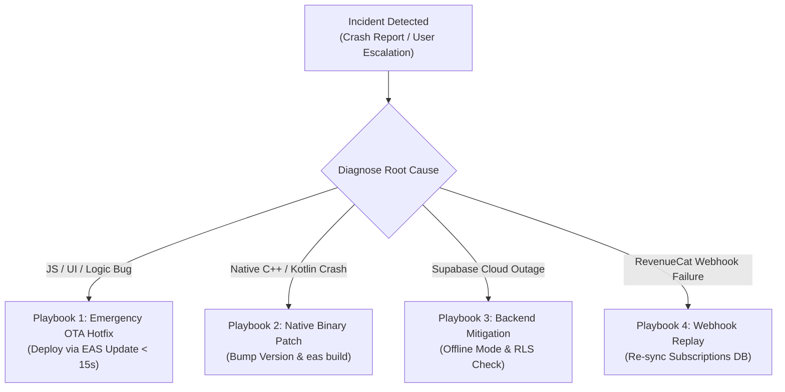

# Replix Incident Response & Reliability Playbook

**Document Version:** 1.0.0  
**Effective Date:** September 17, 2026  
**Application:** Replix Mobile Application (`com.skortan.replix`)  
**Target Audience:** Site Reliability Engineers, Mobile Engineers, On-Call Team  

---

## 1. Executive Overview & Severity Classification

This document outlines standard operating procedures for identifying, diagnosing, mitigating, and recovering from production incidents affecting the Replix mobile ecosystem.

```
┌────────────────────────────────────────────────────────────────────────────────────────┐
│                              INCIDENT SEVERITY MATRIX                                  │
├──────────┬─────────────────────────────┬──────────────┬────────────────────────────────┤
│ Severity │ Definition & Impact         │ Target SLA   │ Typical Triggers               │
├──────────┼─────────────────────────────┼──────────────┼────────────────────────────────┤
│ **P0**   │ Critical Block / Outage     │ < 30 Minutes │ App crashes on launch for all  │
│          │ (App unusable)              │              │ users; Supabase DB offline.    │
├──────────┼─────────────────────────────┼──────────────┼────────────────────────────────┤
│ **P1**   │ Major Degradation           │ < 2 Hours    │ MediaPipe camera engine hangs; │
│          │ (Core tracking failure)     │              │ Purchases failing on App Store │
├──────────┼─────────────────────────────┼──────────────┼────────────────────────────────┤
│ **P2**   │ Moderate Degradation        │ < 8 Hours    │ Leaderboards out of sync; Push │
│          │ (Secondary feature broken)  │              │ notifications failing to send. │
├──────────┼─────────────────────────────┼──────────────┼────────────────────────────────┤
│ **P3**   │ Minor / Cosmetic Issue      │ Next Sprint  │ Misaligned UI elements; Non-   │
│          │ (Workaround available)      │              │ blocking badge render glitch.  │
└──────────┴─────────────────────────────┴──────────────┴────────────────────────────────┘
```

---

## 2. Crash Reporting & Observability Architecture

### 2.1 Critical Vulnerability Assessment

> [!CAUTION]
> **Production Reliability Notice:** The repository currently lacks automated crash-monitoring SDKs (such as Sentry, Datadog, or Firebase Crashlytics). In release builds, uncaught native crashes (e.g., C++/Kotlin OutOfMemory errors in MediaPipe or CameraX driver failures) will silently crash the app to the home screen without alerting engineering. Integrating Sentry is strongly recommended prior to major scaling.

---

### 2.2 Implemented Local Error Handlers

Despite the lack of an external telemetry aggregator, the codebase contains localized defensive boundaries:

1. **Root Boot Failure Guard ([`app/_layout.tsx`](file:///d:/rs/app/_layout.tsx#L110-L148)):**
   - Catches fatal initialization errors in `useAuthStore.initialize()` and displays the error message on screen in debug styling to prevent indefinite splash screen hangs.
2. **Workout Session Error Boundary ([`components/core/ErrorBoundary.tsx`](file:///d:/rs/components/core/ErrorBoundary.tsx)):**
   - Wraps the camera and pose analysis tree. Catches React rendering and sensor lifecycle exceptions, preventing full application crashes and presenting a recovery message.
3. **Database Clock-Skew Retry Interceptor ([`utils/supabase.ts`](file:///d:/rs/utils/supabase.ts#L9-L30)):**
   - Catches `PGRST303` clock-skew HTTP errors caused by client device time drift, waiting 1,000ms and retrying up to 3 times automatically.
4. **Product Analytics Event Tracking ([`services/core/analyticsService.ts`](file:///d:/rs/services/core/analyticsService.ts)):**
   - Dispatches caught authentication and purchase error events to PostHog (`auth_failed`, `purchase_failed`).

---

## 3. Incident Mitigation Playbooks



---

### 3.1 Playbook 1: Emergency JavaScript Hotfix (Instant OTA Deployment)
Use when a regression is isolated to JavaScript/TypeScript, styling, or state management:

1. **Isolate & Patch:** Create a hotfix branch off `main` and commit the bugfix.
2. **Execute Local Validation:**
   ```bash
   npx tsc --noEmit
   npm run lint
   ```
3. **Publish Emergency Over-The-Air Update:**
   ```bash
   # Push hotfix to all live production devices running version 1.0.0
   eas update --channel production --message "P0 Hotfix: Resolve session freeze"
   ```
4. **Verify Deployment:** Launch the physical Android/iOS test device; the app will fetch the update in the background on cold start.

---

### 3.2 Playbook 2: Native Module Crash or CameraX Driver Regression
Use when crashes occur inside `modules/pose-landmarker`, native Android/iOS drivers, or npm native libraries:

1. **Analyze Native Logs:** Connect a physical device and run:
   ```bash
   # Android logcat filter for MediaPipe and Camera errors
   adb logcat -s PoseLandmarker:E AndroidRuntime:E
   ```
2. **Common Culprit Checks:**
   - Verify `imageProxy.close()` is executing in the `finally {}` block in [`PoseLandmarkerView.kt`](file:///d:/rs/modules/pose-landmarker/android/src/main/java/expo/modules/poselandmarker/PoseLandmarkerView.kt#L292).
   - Ensure pre-allocated `Rect` and `Bitmap` buffers are being recycled rather than instantiated per frame.
3. **Compile and Submit Native Binary:**
   ```bash
   # 1. Bump version in app.config.js (e.g. 1.0.0 -> 1.0.1)
   # 2. Trigger EAS production build
   eas build --profile production --platform all
   # 3. Submit expedited binary to App Store Connect & Google Play
   eas submit --profile production --platform all
   ```

---

### 3.3 Playbook 3: Supabase Database Outage or API Degraded
Use when Supabase PostgreSQL, Auth, or Edge Functions experience downtime:

1. **Verify Cloud Status:** Check [Supabase Status](https://status.supabase.com) and the project dashboard.
2. **Client Offline Resilience:**
   - Replix pose tracking and rep counting execute 100% on-device in volatile RAM; workouts continue to function offline.
   - Workout logs are buffered in the Zustand `historyStore` until network connectivity is restored.
3. **Database RLS Lockout Inspection:**
   - If users receive 403 / 401 errors post-migration, inspect [`schema.sql`](file:///d:/rs/schema.sql) for recursive RLS policies on `profiles` or `friends` tables.
   - Run manual query in Supabase SQL editor to test RLS bypass via `service_role`.

---

### 3.4 Playbook 4: RevenueCat Webhook & Entitlement Desync
Use when users purchase Pro subscriptions but Pro features remain locked:

1. **Inspect Webhook Logs:** Navigate to Supabase Dashboard > Edge Functions > `rc-webhook` > Logs.
2. **Verify Authorization Header:** Ensure `REVENUECAT_WEBHOOK_SECRET` in Supabase Secrets matches the authorization token set in the RevenueCat Dashboard Webhook settings.
3. **Manual Entitlement Sync:** If webhooks were dropped during a server outage:
   - Request the user tap **Settings > Legal & Account > Restore Purchases**.
   - Or manually grant access in Supabase SQL Editor:
     ```sql
     UPDATE profiles SET is_premium = true WHERE id = 'TARGET_USER_UUID';
     UPSERT INTO subscriptions (user_id, status, tier, expires_at)
     VALUES ('TARGET_USER_UUID', 'active', 'pro', NOW() + INTERVAL '1 year');
     ```

---

## 4. Post-Incident Review (PIR) Process

Within 24 hours of resolving a P0 or P1 incident, the on-call engineer must complete a Post-Incident Review documenting:
1. **Root Cause Analysis (5 Whys)**.
2. **Total User Impact & Downtime Duration**.
3. **Action Items to Prevent Recurrence** (e.g., adding automated regression tests, telemetry alerting).
