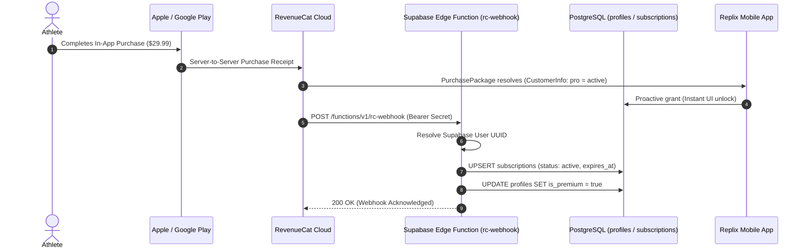

# RevenueCat Subscription Management & Webhook Operations Guide

**Document Version:** 1.0.0  
**Effective Date:** September 17, 2026  
**Application:** Replix Mobile Application (`com.skortan.replix`)  
**SDK Package:** `react-native-purchases` v10.9.0  
**Integration Stack:** RevenueCat Cloud -> Supabase Edge Function (`rc-webhook`) -> PostgreSQL DB  

---

## 1. Executive Summary

Replix orchestrates in-app purchases and subscription entitlements through **RevenueCat**. 

The app employs a **hybrid dual-layer entitlement architecture**:
1. **Client-Side Real-Time Verification:** Handled dynamically via `Purchases.getCustomerInfo()` and `useSubscriptionStore` for zero-latency UI unlock upon purchase.
2. **Server-Side Truth & Persistence:** RevenueCat server webhooks dispatch event payloads directly to the Supabase [`rc-webhook`](file:///d:/rs/supabase/functions/rc-webhook/index.ts) Edge Function to maintain long-term state across the `subscriptions` and `profiles` PostgreSQL tables.

---

## 2. Product Catalog, Offerings, & Entitlements Configuration

To ensure 100% compatibility with the mobile client, configure the **RevenueCat Dashboard** as follows:

```
┌────────────────────────────────────────────────────────────────────────────────────────┐
│                               REVENUECAT CONFIGURATION MATRIX                          │
├─────────────────────┬───────────────────┬──────────────┬───────────────────────────────┤
│ RevenueCat Entity   │ Expected Identifier│ Value / Type │ StoreKit & Play Billing Match │
├─────────────────────┼───────────────────┼──────────────┼───────────────────────────────┤
│ **Entitlement ID**  │ `pro`             │ Boolean Flag │ Unlocks all Pro gated screens │
├─────────────────────┼───────────────────┼──────────────┼───────────────────────────────┤
│ **Offering ID**     │ `default`         │ Current Offer│ Contains Annual & Monthly pkgs│
├─────────────────────┼───────────────────┼──────────────┼───────────────────────────────┤
│ **Package 1**       │ `annual`          │ Annual Tier  │ App Store ID: `replix_annual` │
│                     │                   │ ($29.99/yr)  │ Play Store ID: `replix_annual`│
│                     │                   │ 7-Day Trial  │ (Free trial intro offer)      │
├─────────────────────┼───────────────────┼──────────────┼───────────────────────────────┤
│ **Package 2**       │ `monthly`         │ Monthly Tier │ App Store ID: `replix_monthly`│
│                     │                   │ ($4.99/mo)   │ Play Store ID: `replix_monthly│
└─────────────────────┴───────────────────┴──────────────┴───────────────────────────────┘
```

### 2.1 Codebase Fallback Offerings ([`premiumService.ts`](file:///d:/rs/services/core/premiumService.ts#L137-L178))
If network issues prevent fetching live offerings from RevenueCat servers, `premiumService.ts` automatically populates hardcoded fallback offerings to prevent client crashes:
- `replix_annual`: `$29.99` (with 7-Day trial flag)
- `replix_monthly`: `$4.99`

### 2.2 Concurrency Guards & Debounce Protection ([`premiumService.ts`](file:///d:/rs/services/core/premiumService.ts) & [`premium.tsx`](file:///d:/rs/app/(profile)/premium.tsx))
To eliminate race conditions and avoid double-billing when users tap purchase or restore buttons multiple times:
1. **UI-Level Debounce Refs:** `isPurchasingRef` and `isRestoringRef` block rapid multi-touch triggers synchronously before state re-renders occur.
2. **Service-Level Mutex Locks:** `isPurchaseInProgress` and `isRestoreInProgress` flags in `premiumService.ts` reject concurrent purchase or restore requests at the service layer.
3. **`OperationAlreadyInProgressError` Fallback:** If RevenueCat returns error code `7` (`OperationAlreadyInProgressError`), the service gracefully catches the exception, validates current `Purchases.getCustomerInfo()`, and updates the local store state rather than surfacing an unexpected error prompt to the user.

---

## 3. Webhook Architecture & Database Synchronization



---

### 3.1 Webhook Endpoint Configuration
- **Endpoint URL:** `https://<YOUR_SUPABASE_PROJECT_ID>.supabase.co/functions/v1/rc-webhook`
- **Authorization:** `Bearer <REVENUECAT_WEBHOOK_SECRET>` (Set in Supabase Secrets)

### 3.2 Webhook Event Lifecycle Handling ([`rc-webhook/index.ts`](file:///d:/rs/supabase/functions/rc-webhook/index.ts#L70-L90)):

| Event Type | `subscriptions.status` | `profiles.is_premium` | Action Description |
| :--- | :--- | :--- | :--- |
| `INITIAL_PURCHASE` | `"active"` | `true` | New subscriber; unlocks Pro immediately. |
| `RENEWAL` | `"active"` | `true` | Subscription renewed; extends `expires_at`. |
| `UNCANCELLATION` | `"active"` | `true` | User re-enabled auto-renewal. |
| `CANCELLATION` | `"cancelled"` | `true` *(Retained)* | Auto-renew disabled; user retains access until `expires_at`. |
| `EXPIRATION` | `"expired"` | `false` | Billing period ended; Pro features locked. |
| `BILLING_ISSUE` | `"expired"` | `false` | Payment failure / card declined; revokes Pro. |

---

## 4. User Identity Synchronization (`Purchases.logIn`)

To prevent anonymous purchase fragmentation:
1. When an athlete logs in or creates an account, [`premiumService.ts`](file:///d:/rs/services/core/premiumService.ts#L48-L49) calls:
   ```typescript
   await Purchases.logIn(userId);
   ```
2. RevenueCat binds the internal store customer identifier to the athlete's **Supabase User UUID**.
3. If an anonymous user (`$RCAnonymousID...`) purchases a subscription, logging in merges the alias to the registered UUID seamlessly.

---

## 5. Support Operations & Administrative Workflows

### 5.1 Granting Promotional / Complimentary Access
To grant a user free Pro access (for influencer partnerships, customer service remediation, or internal testing):

#### Method A: Via RevenueCat Dashboard (Recommended)
1. Go to **RevenueCat Dashboard > Customers**.
2. Search for the user by their **Supabase User UUID** or email.
3. Click **"+ Grant Promotional Entitlement"**.
4. Select Entitlement: `pro` and choose duration (e.g., *1 Month*, *1 Year*, or *Lifetime*).
5. The user's app will unlock Pro features on next launch automatically.

#### Method B: Direct Database Override (Emergency)
Run in Supabase SQL Editor:
```sql
-- 1. Unlock profile
UPDATE profiles 
SET is_premium = true 
WHERE id = 'TARGET_USER_UUID';

-- 2. Upsert subscription record
INSERT INTO subscriptions (user_id, status, tier, expires_at)
VALUES ('TARGET_USER_UUID', 'active', 'pro', NOW() + INTERVAL '1 year')
ON CONFLICT (user_id) 
DO UPDATE SET 
  status = 'active', 
  tier = 'pro', 
  expires_at = NOW() + INTERVAL '1 year',
  updated_at = NOW();
```

---

### 5.2 Customer Purchase Restoration
If an athlete reinstalls the app or switches devices:
1. Instruct the user to navigate to **Profile > Settings > Legal & Account > Restore Purchases**.
2. The client calls [`premiumService.restorePurchases(userId)`](file:///d:/rs/services/core/premiumService.ts#L243-L276).
3. StoreKit / Google Play Billing validates the device store account and syncs active entitlements back to Supabase.

---

### 5.3 RevenueCat Sandbox Testing Checklist
- **iOS Sandbox Testing:** Use an Apple Sandbox Tester account in iPhone Settings > App Store > Sandbox Account.
- **Android License Testing:** Add tester email to Google Play Console > Setup > License Testing.
- **Time Acceleration in Sandbox:**
  - 1 Month Subscription = Renews every 5 minutes (expires after 6 renewals).
  - 1 Year Subscription = Renews every 30 minutes.
