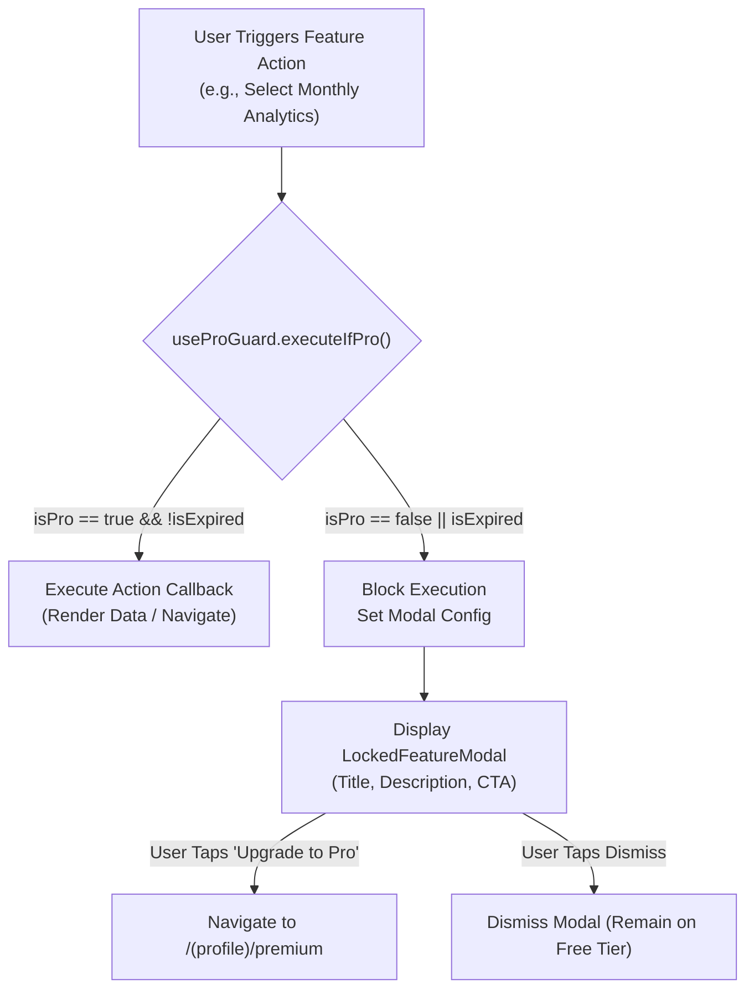

# Replix Product Feature Matrix & Paywall Architecture

**Document Version:** 1.0.0  
**Effective Date:** September 17, 2026  
**Application:** Replix Mobile Application (`com.skortan.replix`)  
**Target Platforms:** iOS 15.1+ & Android 10+ (API 29+)  
**Framework Stack:** React Native 0.81.5, React 19.1.0, Expo SDK 54, Supabase, RevenueCat, MediaPipe Tasks Vision  

---

## 1. Executive Summary

Replix is an offline-capable, computer-vision-powered fitness tracking application designed to provide real-time biomechanical analysis, rep counting, and form coaching directly on mobile devices without specialized hardware or cloud video streaming. 

This document serves as the single source of truth for the active feature set, pricing tier boundaries, fallback behaviors, and development utilities currently implemented in the codebase.

---

## 2. Core Feature Matrix

```
┌─────────────────────────────────────────────────────────────────────────────────────────────────────────┐
│                                     REPLIX CORE FEATURE MATRIX                                          │
├──────────────────────────┬─────────────────────────────────────────────────┬──────────────┬─────────────┤
│ Domain                   │ Specific Feature Capability                     │ Free Tier    │ Replix Pro  │
├──────────────────────────┼─────────────────────────────────────────────────┼──────────────┼─────────────┤
│ **Authentication**       │ Email / Password Registration & Login           │ YES          │ YES         │
│                          │ 6-Digit Auto-Submitting Email OTP Verification  │ YES          │ YES         │
│                          │ Google OAuth & Apple Sign-In Deep Linking       │ YES          │ YES         │
│                          │ Password Reset & PKCE Token Refreshing          │ YES          │ YES         │
├──────────────────────────┼─────────────────────────────────────────────────┼──────────────┼─────────────┤
│ **Onboarding**           │ 60 FPS Skia Pose Preview & Value Proposition    │ YES          │ YES         │
│                          │ Physical Metrics Setup (Height, Weight, Goals)  │ YES          │ YES         │
├──────────────────────────┼─────────────────────────────────────────────────┼──────────────┼─────────────┤
│ **Real-Time AI Vision**  │ On-Device 33 3D Skeletal Landmark Extraction    │ YES          │ YES         │
│                          │ Pushup Kinematic Engine & Lockout Tracking      │ YES          │ YES         │
│                          │ Squat Kinematic Engine & Parallel Depth Check   │ YES          │ YES         │
│                          │ Plank Kinematic Engine & Stability Timer        │ YES          │ YES         │
│                          │ 5-Stage Anti-Cheat & 2D Screen Protection       │ YES          │ YES         │
│                          │ Real-Time Voice Coach (`expo-speech`)           │ YES          │ YES         │
│                          │ Rep Sound Effects & Haptic Pulses               │ YES          │ YES         │
│                          │ Real-Time Dynamic SVG Skeletal Overlay          │ YES          │ YES         │
│                          │ Configurable Prep Countdown Timer (3s–10s)      │ YES          │ YES         │
├──────────────────────────┼─────────────────────────────────────────────────┼──────────────┼─────────────┤
│ **Workout History**      │ Current Month Workout Feed & Set Breakdown      │ YES          │ YES         │
│                          │ Historical Months Archive (>30 Days)            │ GATED (Pro)  │ YES         │
│                          │ Personal Records (PR) Banner & Max Reps         │ YES          │ YES         │
│                          │ Calendar Day Filter Picker                      │ YES          │ YES         │
├──────────────────────────┼─────────────────────────────────────────────────┼──────────────┼─────────────┤
│ **Analytics & Trends**   │ Weekly Volume & Accuracy Trends                 │ YES          │ YES         │
│                          │ Monthly Training Volume & Biomechanical Curves  │ GATED (Pro)  │ YES         │
│                          │ Yearly Progression & Rep Aggregations           │ GATED (Pro)  │ YES         │
├──────────────────────────┼─────────────────────────────────────────────────┼──────────────┼─────────────┤
│ **Gamification**         │ XP System & Level Progression (Levels 1–50)     │ YES          │ YES         │
│                          │ Daily & Weekly Fitness Quests                   │ YES          │ YES         │
│                          │ Achievement Badges & Rare Trophies              │ YES          │ YES         │
│                          │ Day Streak Tracking & Freeze Protection         │ YES          │ YES         │
│                          │ Periodic Global & Friends Celebration Modals    │ YES          │ YES         │
├──────────────────────────┼─────────────────────────────────────────────────┼──────────────┼─────────────┤
│ **Social & Community**   │ Global Weekly Leaderboard                       │ YES          │ YES         │
│                          │ Global Monthly Leaderboard                      │ GATED (Pro)  │ YES         │
│                          │ Friends Weekly Leaderboard                      │ YES          │ YES         │
│                          │ Username Search & Friend Requests               │ YES          │ YES         │
│                          │ Basic Friend Profile (Rank, Level, Trophies)    │ YES          │ YES         │
│                          │ Detailed Friend Intel (Streak, PRs, Volume)     │ GATED (Pro)  │ YES         │
│                          │ Workout Share Sheet (`expo-sharing`)            │ YES          │ YES         │
├──────────────────────────┼─────────────────────────────────────────────────┼──────────────┼─────────────┤
│ **Notifications**        │ Morning Motivational Workout Briefings          │ YES          │ YES         │
│                          │ Streak Expiry Reminder Push Notifications       │ YES          │ YES         │
│                          │ Friend Request Acceptance Alerts                │ YES          │ YES         │
├──────────────────────────┼─────────────────────────────────────────────────┼──────────────┼─────────────┤
│ **Account & Settings**   │ Profile Editing (Avatar, Bio, Body Stats)       │ YES          │ YES         │
│                          │ Haptic / Audio Coach Preference Toggles         │ YES          │ YES         │
│                          │ In-App Self-Serve Account Deletion              │ YES          │ YES         │
│                          │ StoreKit / Play Billing Purchase Restoration    │ YES          │ YES         │
└──────────────────────────┴─────────────────────────────────────────────────┴──────────────┴─────────────┘
```

---

## 3. Subscription & Paywall Architecture (Replix Pro)

### 3.1 Pro Gating Implementation (`useProGuard.ts`)
Access to premium features is controlled on the client via the [`useProGuard`](file:///d:/rs/hooks/useProGuard.ts) hook and [`ProVisibilityGate`](file:///d:/rs/components/ui/ProVisibilityGate.tsx) component. The system evaluates:
1. **Live Store Entitlements:** Validates `isPro` state from `useSubscriptionStore` (synced via RevenueCat SDK).
2. **Expiration Enforcement:** Evaluates `expiresAt` timestamp against `Date.now()`. If a subscription has lapsed in the foreground, features are instantly locked and the user state transitions to Free.
3. **Database Fallback:** Checks `is_premium` boolean on the Supabase `profiles` record.



---

### 3.2 Detailed Feature Gating Matrix

#### 1. Workout History Archive Navigation
- **Location:** [`app/(tabs)/analytics.tsx`](file:///d:/rs/app/(tabs)/analytics.tsx#L137-L155) (`HistoryTab`)
- **Free Tier:** Users can browse all workouts completed within the current calendar month.
- **Paywall Trigger:** Tapping `<` to navigate to previous calendar months invokes `executeIfPro()`.
- **Pro Modal Copy:**
  - *Title:* "Unlock History Archive"
  - *Description:* "Access your complete workout history and training logs across all past months with Replix Pro."

#### 2. Advanced Analytics Ranges (Month & Year)
- **Location:** [`app/(tabs)/analytics.tsx`](file:///d:/rs/app/(tabs)/analytics.tsx#L204-L220) (`StatisticsTab`)
- **Free Tier:** Weekly volume trends and weekly accuracy averages (`selectedRange === "week"`).
- **Paywall Trigger:** Selecting the **"Month"** or **"Year"** segmented control tab invokes `executeIfPro()`. If Pro status expires while viewing a month/year chart, the component automatically resets the range to "Week".
- **Pro Modal Copy:**
  - *Title:* "Unlock Advanced Analytics"
  - *Description:* "Access in-depth monthly and yearly training trends, volume progression, and biomechanical accuracy curves with Replix Pro."

#### 3. Global Monthly Leaderboard
- **Location:** [`app/(tabs)/leaderboard.tsx`](file:///d:/rs/app/(tabs)/leaderboard.tsx#L350-L375)
- **Free Tier:** Unlimited access to the Global Weekly and Friends Weekly leaderboards.
- **Paywall Trigger:** Selecting the **"This Month"** segment on the global leaderboard.
- **Visual Indicator:** Displays a lock icon next to the "This Month" tab via `AnimatedSegmentedControl`.
- **Pro Modal Copy:**
  - *Title:* "Unlock Monthly Leaderboard"
  - *Description:* "Upgrade to Replix Pro to view full monthly rankings and see where you stand on the global leaderboard."

#### 4. Friend Profile Performance Intel
- **Location:** [`app/(social)/friend-profile.tsx`](file:///d:/rs/app/(social)/friend-profile.tsx)
- **Free Tier:** Can view a friend's public username, avatar, joined date, monthly global rank, level progress bar, achievements, and earned podium trophies (with interactive Weekly and Monthly timeframe tabs via `ProfileTrophyTabBar`).
- **Paywall Trigger:** The **Performance Intel** card (active streak count, total repetition volume, Max Pushup PR, Max Squat PR) is obscured by a Gaussian blur overlay (`BlurView` intensity: 20–30) with teaser numbers.
- **Pro Tier:** Unlocks full, real-time unblurred stats.

#### 5. Profile Screen Status Card & Entitlement Verification
- **Location:** [`app/(tabs)/profile.tsx`](file:///d:/rs/app/(tabs)/profile.tsx)
- **Entitlement Verification:** Evaluated securely via `useProGuard` (`isPro`) / `useSubscriptionStore` across client state (and not solely on the legacy `profile.is_premium` flag).
- **Free Tier:** Renders a frosted-glass upgrade banner with an "Upgrade" CTA navigating to the paywall.
- **Pro Tier:** Displays a "Replix Pro Active Member" status card with a gold star badge and active status pill.
- **Action Buttons:** Tactile `Edit` and `Settings` buttons (`bg-[#161618] border border-white/10`).

#### 6. VIP Crown Indicators
- **Location:** [`components/ui/ProVisibilityGate.tsx`](file:///d:/rs/components/ui/ProVisibilityGate.tsx), [`LeaderboardCard.tsx`](file:///d:/rs/components/social/LeaderboardCard.tsx)
- **Visuals:** Gold crown badge (`#F0B35C`) rendered beside Pro athletes on leaderboard rows, profile headers, and celebration modals.

---

### 3.3 Active Pricing & Subscription Products

Configured in [`services/core/premiumService.ts`](file:///d:/rs/services/core/premiumService.ts) and [`store/core/premiumStore.ts`](file:///d:/rs/store/core/premiumStore.ts):

| Identifier | Billing Period | Price (USD) | Trial Period | StoreKit / Play Billing ID |
| :--- | :--- | :--- | :--- | :--- |
| `replix_monthly` | Monthly | **$4.99 / mo** | None | `replix_monthly` |
| `replix_annual` | Annual | **$29.99 / yr** | **7-Day Free Trial** | `replix_annual` |

---

## 4. Edge Cases, Failures, & Graceful Fallbacks

| Subsystem / Trigger | Failure Scenario | Implemented Codebase Fallback | Source File |
| :--- | :--- | :--- | :--- |
| **Camera Hardware** | Camera permission denied by user | Renders full-screen permission banner with explanation and direct `Linking.openSettings()` trigger button. | `PoseLandmarkerView.kt`, `workout-session.tsx` |
| **MediaPipe Vision** | Poor lighting / occluded joint landmarks | `PoseService.ts` detects confidence score `< 0.5`. Triggers voice warning ("Step into camera frame") and pauses tracking without corrupting rep count. | `PoseService.ts`, `workoutStore.ts` |
| **Movement Anti-Cheat** | Projected 2D video / screen cheating | 5-stage validation checks 3D depth variance (`z-coordinate`) and limb ratio biomechanics; invalid reps are rejected and flagged. | `PoseService.ts`, `KineticMath.ts` |
| **Network Offline** | No internet during workout session | 100% of pose tracking and rep counting executes offline in local RAM. Workout metrics are saved to Zustand store and synchronized to Supabase upon reconnect. | `workoutStore.ts`, `historyStore.ts` |
| **RevenueCat Sandbox** | Network failure fetching live offerings | Fallback hardcoded offerings list (`$4.99` and `$29.99`) is populated automatically so paywall UI never crashes. | `premiumService.ts#L138-L178` |
| **Database Clock Skew** | Client device clock skewed (`PGRST303`) | Custom `fetch` interceptor catches `PGRST303`, waits 1,000ms, and automatically retries the query up to 3 times. | `utils/supabase.ts#L9-L30` |
| **Account Deletion** | Local account deletion initiated | In-app alert prompts user for destructive confirmation before initiating sign out and navigation to welcome screen. | `settings.tsx#L239-L264` |

---

## 5. Work in Progress (WIP) & Developer Testing Utilities

The codebase contains specific developer preview tools and UI test harness features intentionally mounted in settings for internal QA:

### 5.1 Developer Celebration & Paywall Tools
Located in [`app/(profile)/settings.tsx`](file:///d:/rs/app/(profile)/settings.tsx#L368-L457):
1. **Celebration Modal Previews:**
   - *Preview Premium Unlocked:* Triggers gold crown celebration popup.
   - *Trigger Weekly Friends Celebration:* Dispatches simulated top-ranking friends modal.
   - *Trigger Weekly Global Celebration:* Dispatches simulated global tier recap modal.
   - *Trigger Monthly Global Celebration:* Dispatches end-of-month trophy awarding modal.
2. **Paywall Modal Testers:**
   - *Preview Locked Feature Modal:* Opens the action interceptor bottom sheet.
   - *Open Full Premium Paywall Screen:* Navigates directly to `/(profile)/premium`.
3. **Gamification Toast Queue Testers:**
   - *Test Quest Toast:* Simulates "+50 XP Quick Pump" notification.
   - *Test Trophy Toast:* Simulates unlocking `"THE JUGGERNAUT"` badge.
4. **Onboarding Interactive Preview:**
   - *Preview Interactive Onboarding:* Renders the full 60 FPS Skia pose tracking onboarding flow inside a modal.

### 5.2 Pending Backend Integrations
- **Remote Account Deletion RPC:** The UI in [`settings.tsx`](file:///d:/rs/app/(profile)/settings.tsx#L251-L254) triggers a local delay before client signout. A dedicated Supabase edge function (`delete-user-account`) is planned to execute the cascading database delete securely on the server.
- **In-App Purchase Restore on Settings Screen:** [`settings.tsx`](file:///d:/rs/app/(profile)/settings.tsx#L205-L216) contains a local delay handler; the production restoration pipeline is active in [`premiumService.ts`](file:///d:/rs/services/core/premiumService.ts) and [`premium.tsx`](file:///d:/rs/app/(profile)/premium.tsx).
