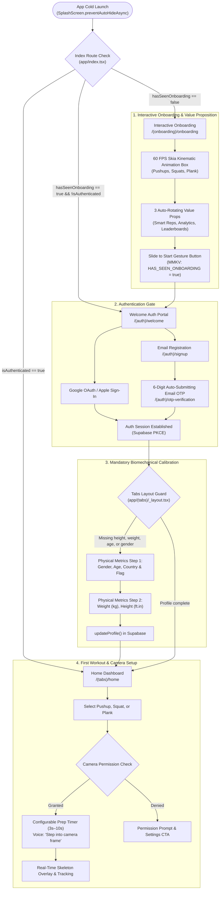

# Replix New User Onboarding & First-Launch Experience

**Document Version:** 1.0.0  
**Effective Date:** September 17, 2026  
**Application:** Replix Mobile Application (`com.skortan.replix`)  
**Target Audience:** Product Managers, UX Designers, Mobile Engineers, QA Teams  

---

## 1. Executive Overview

The onboarding journey in **Replix** is engineered to minimize initial friction while ensuring that critical biomechanical telemetry (height, weight, age, biological gender) and hardware permissions (Camera for MediaPipe vision, Push Tokens for retention) are configured before the user logs their first workout.

Unlike traditional fitness apps that lock the user behind a mandatory upfront credit card paywall, Replix employs a **"Value-First / Freemium"** strategy: new users can complete onboarding, calibrate their physical metrics, and immediately perform AI-tracked workouts on the Free Tier without entering payment details.

---

## 2. Step-by-Step First-Launch Navigation Sequence



---

## 3. Screen Breakdown & Data Flow

### 3.1 Step 1: Cold Start & Routing Resolution
- **Route:** [`app/index.tsx`](file:///d:/rs/app/index.tsx) & [`app/_layout.tsx`](file:///d:/rs/app/_layout.tsx)
- **Execution:**
  1. `SplashScreen.preventAutoHideAsync()` holds the splash screen while loading custom fonts (`OutfitRegular`, `OutfitMedium`, `OutfitBold`, `OutfitBlack`).
  2. `storageService.hasSeenOnboarding()` performs a synchronous C++ lookup via `react-native-mmkv` for the key `HAS_SEEN_ONBOARDING`.
  3. `useAuthStore.initialize()` verifies existing Supabase session tokens in local `AsyncStorage`.
  4. If authenticated -> redirects directly to `/(tabs)/home`.
  5. If first launch (`hasSeenOnboarding === false`) -> redirects to `/(onboarding)/onboarding`.
  6. If returning unauthenticated user -> redirects to `/(auth)/welcome`.

---

### 3.2 Step 2: Interactive 60 FPS Skia Onboarding
- **Route:** [`app/(onboarding)/onboarding.tsx`](file:///d:/rs/app/(onboarding)/onboarding.tsx)
- **UI Architecture:**
  - **Dynamic Kinematic Box (`PoseEngineSkeletonBox`):** A custom Canvas rendered via `@shopify/react-native-skia` running at 60 FPS on the native C++ UI thread. It dynamically animates a synthetic 33-point skeletal figure performing pushups, squats, and plank holds.
  - **Auto-Rotating Feature Slides (`SwipeableFeatureCard`):** Displays 3 core value propositions on a 4-second automated carousel (with pan gesture drag support):
    1. *Smart Rep Counting:* "AI-powered camera tracking counts your reps and hold times automatically in real time—zero wearables or screen tapping needed."
    2. *Detailed Analytics & History:* "Track workout history, volume charts, personal bests, and daily consistency to measure your continuous progress."
    3. *Leaderboards & Achievements:* "Compete on global and friends leaderboards, complete quests, maintain streaks, and unlock milestone trophies."
  - **Slide-to-Start Button (`SwipeToStartButton`):** An interactive pan-gesture slider with spring physics that sets `HAS_SEEN_ONBOARDING = true` in MMKV and routes the athlete to `/(auth)/welcome`.

---

### 3.3 Step 3: Welcome & Social Authentication Portal
- **Route:** [`app/(auth)/welcome.tsx`](file:///d:/rs/app/(auth)/welcome.tsx)
- **Features:**
  - Centered hero typography: *"Train, compete and progress."*
  - **Apple Sign-In (iOS exclusive):** Native StoreKit / Apple OAuth button rendered at the top of the action stack.
  - **Google OAuth:** One-tap Google Sign-In with deep-link redirection (`replix://auth-callback`).
  - **Email Sign Up / Login:** Routes to standard email registration (`/(auth)/signup`) or existing user login (`/(auth)/signin`).
  - **Legal Footer:** Direct links to [Terms of Service](file:///d:/rs/docs/legal-and-compliance/terms-of-service.md) and [Privacy Policy](file:///d:/rs/docs/legal-and-compliance/privacy-policy.md).

---

### 3.4 Step 4: Authentication & OTP Verification
- **Routes:** [`app/(auth)/signup.tsx`](file:///d:/rs/app/(auth)/signup.tsx), [`app/(auth)/otp-verification.tsx`](file:///d:/rs/app/(auth)/otp-verification.tsx)
- **Sequence:**
  1. Athlete enters Full Name, Email, Password, and Username (with real-time regex & uniqueness check).
  2. Supabase dispatches a 6-digit numeric OTP code to the athlete's email.
  3. `otp-verification.tsx` renders 6 individual digit cells with automatic clipboard paste detection and auto-submission on the 6th digit.
  4. Session is established with PKCE token storage.

---

### 3.5 Step 5: Mandatory Biomechanical Calibration
- **Route:** [`app/(onboarding)/physical-metrics.tsx`](file:///d:/rs/app/(onboarding)/physical-metrics.tsx)
- **Trigger Gate:** Controlled by [`app/(tabs)/_layout.tsx`](file:///d:/rs/app/(tabs)/_layout.tsx#L324-L333). If an authenticated athlete is missing `weight_kg`, `height_cm`, `age`, or `gender`, the app automatically intercepts routing and pushes this screen.
- **Step 1:**
  - **Biological Gender:** Male, Female, Other.
  - **Age:** Integer input validated between 13 and 100 years.
  - **Country & Flag:** Searchable modal picker ([`CountrySelectModal.tsx`](file:///d:/rs/components/modals/CountrySelectModal.tsx)) storing country name and unicode emoji flag for global leaderboards.
- **Step 2:**
  - **Weight:** Numeric input in kilograms (validated 20 kg – 150 kg).
  - **Height:** Dual format input in Feet & Inches (e.g. `5.11`), automatically converted and stored in centimeters (`height_cm = Math.round(ft * 30.48 + inch * 2.54)`).
- **Completion:** Submits to Supabase `profiles` table via `profileStore.updateProfile()` and navigates to `/(tabs)/home`.

---

## 4. Permissions Flow & Device Hardware Requests

```
┌────────────────────────────────────────────────────────────────────────────────────────────────────────┐
│                                   HARDWARE PERMISSIONS LIFECYCLE                                       │
├───────────────────┬──────────────────────┬─────────────────────────────────────────────────────────────┤
│ Permission Type   │ Request Trigger Point│ Fallback Behavior if Denied                                 │
├───────────────────┼──────────────────────┼─────────────────────────────────────────────────────────────┤
│ **Camera**        │ Root App Launch      │ Full-screen banner on workout session with explanation and  │
│ (MediaPipe/Video) │ (`app/_layout.tsx`)  │ direct `Linking.openSettings()` button.                     │
├───────────────────┼──────────────────────┼─────────────────────────────────────────────────────────────┤
│ **Push Tokens**   │ Background Service   │ Graceful degradation. Workout reminders and friend alerts   │
│ (`expo-notifs`)   │ (`usePushNotifications`) are disabled without blocking any UI or workout features. │
├───────────────────┼──────────────────────┼─────────────────────────────────────────────────────────────┤
│ **Motion Sensors**│ Workout Session Start│ Silent degradation. Accelerometer and Light Sensor monitor  │
│ (Tilt / Lighting) │ (`workout-session.tsx`) phone orientation and low light without system prompts.     │
└───────────────────┴──────────────────────┴─────────────────────────────────────────────────────────────┘
```

### Camera Permission Details:
- **Pre-Warming Strategy:** In [`app/_layout.tsx`](file:///d:/rs/app/_layout.tsx#L40-L47), `useCameraStore.getState().requestPermissions()` is triggered in the background during initial bootstrap. This prevents camera initialization lag when the athlete later navigates to the workout screen.
- **Permission Denial Handling:** If the user denies camera access, [`workout-session.tsx`](file:///d:/rs/app/(workout)/workout-session.tsx#L80-L90) renders an error alert: *"Camera permission is required to analyze exercise form and count repetitions."* with a direct CTA to device system settings.

### Apple Health & Google Fit:
- **Codebase Reality:** There are **zero** HealthKit (`react-native-health`) or Google Fit permissions in the codebase. Workout calories and volume are calculated purely on-device and stored in Supabase.

---

## 5. Paywall Presentation Strategy

- **No Upfront Mandatory Paywall:** Replix does **not** block new users with an upfront paywall during onboarding.
- **Free Tier Default:** Every new user immediately enters the full-featured Free Tier upon completing physical metrics.
- **Contextual Pro Discovery:**
  - **History Archive Gate:** Triggered when tapping `<` on past months in the Analytics tab.
  - **Advanced Analytics Gate:** Triggered when selecting "Month" or "Year" trend charts.
  - **Monthly Leaderboard Gate:** Triggered when selecting "This Month" on global rankings.
  - **Friend Intel Gate:** Triggered when viewing blurred performance cards on friend profiles.
- **On-Demand Paywall Screen:** Accessible anytime via **Profile > Premium** ([`app/(profile)/premium.tsx`](file:///d:/rs/app/(profile)/premium.tsx)), displaying the **$29.99/year** (with 7-Day Free Trial) and **$4.99/month** options.

---

## 6. "First Workout" Biomechanical Tutorial & Camera Guidance

When a user initiates their first workout in [`app/(workout)/workout-session.tsx`](file:///d:/rs/app/(workout)/workout-session.tsx):

```
┌────────────────────────────────────────────────────────────────────────────────────────┐
│                        REAL-TIME CAMERA POSITIONING & TUTORIAL CUES                    │
├────────────────────────────────────────────────────────────────────────────────────────┤
│ 1. PREP COUNTDOWN TIMER: A configurable countdown (3s–10s, default 5s) displays      │
│    full-screen with audio beeps, allowing the user to step back into full view.        │
│                                                                                        │
│ 2. VOICE COACH GUIDANCE: `expo-speech` audio announcements prompt the athlete:        │
│    • "Step into camera frame" (when joint confidence < 0.5)                            │
│    • "Lower your hips" / "Keep back straight" (when joint deviation exceeds threshold) │
│                                                                                        │
│ 3. LIVE SKELETAL OVERLAY: Dynamic SVG skeleton renders in real-time over the feed:    │
│    • Green skeleton lines = Valid form & locked-in posture.                            │
│    • Red / Yellow skeleton lines = Biomechanical deviation or occluded joint.         │
│                                                                                        │
│ 4. HARDWARE SENSORS:                                                                  │
│    • Accelerometer alerts user if the phone is tilted incorrectly or fallen over.      │
│    • Light sensor warns user if ambient lighting is too dim for accurate tracking.     │
└────────────────────────────────────────────────────────────────────────────────────────┘
```

---

## 7. UX Friction Points & Optimization Opportunities

Based on static code analysis of the onboarding pipeline, the following edge cases and potential friction points are documented:

1. **Pre-Warming Camera Permission on First Launch:**
   - *Observation:* `app/_layout.tsx` triggers `requestPermissions()` immediately when the app boots up.
   - *Impact:* New users may see a system "Allow Camera" dialog before they have even seen the onboarding value proposition or welcome screen.
   - *Recommendation:* Defer camera permission requesting until the athlete taps "Start Workout" or enters the workout setup modal.

2. **Strict Physical Metrics Validation:**
   - *Observation:* In `physical-metrics.tsx`, height must follow the exact `FT.IN` format (e.g. `5.11`), and inches must be `< 12`.
   - *Impact:* Users typing `6` without decimals or entering centimeters directly will trigger a validation error toast.
   - *Mitigation:* Ensure UI input masks or wheel pickers guide the user to prevent syntax errors.

3. **Returning User Profile Metric Gate:**
   - *Observation:* In `app/(tabs)/_layout.tsx`, if a returning user signs in on a new device and their profile has null values for `weight_kg` or `height_cm`, they are automatically redirected to `/(onboarding)/physical-metrics`.
   - *Status:* Working as designed to guarantee valid calorie and biomechanical calculations.
