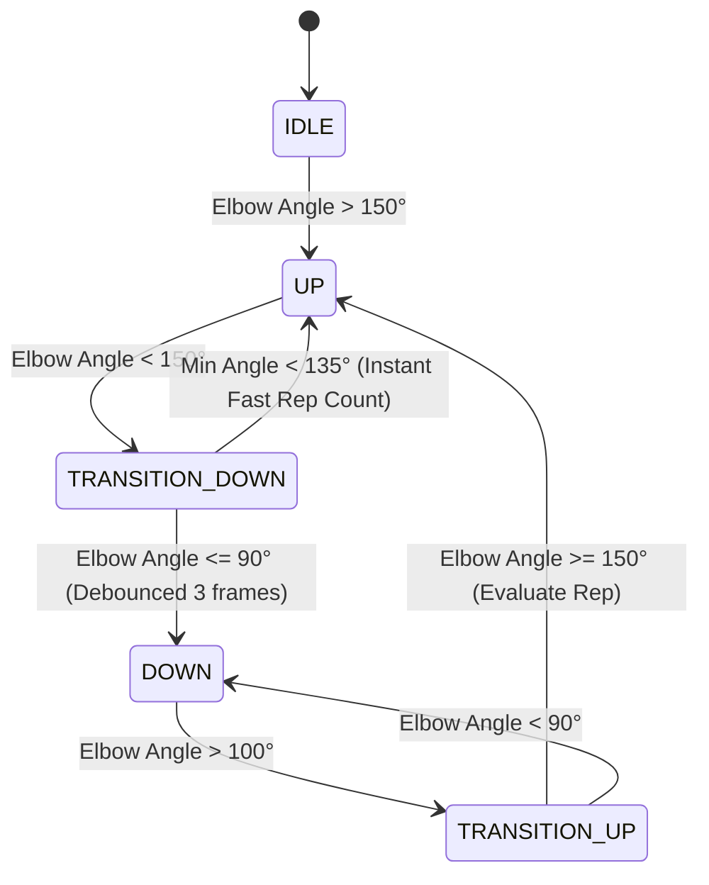
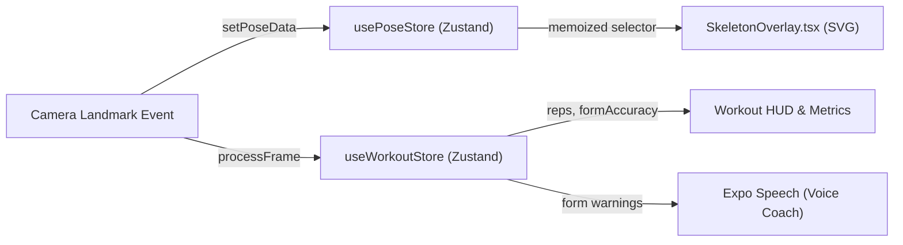

# AI Computer Vision & Kinematic Tracking Engine Specification

## 1. Engine Architecture & Pipeline Overview

Replix implements an **on-device, zero-latency computer vision pipeline** engineered specifically for real-time human pose estimation, biometric privacy, and deterministic kinematic workout tracking.

### Core Architectural Directives
1. **Zero Cloud Video Ingestion**: Frame processing is 100% on-device. Video frames are captured, analyzed via GPU inference, and discarded from volatile memory buffers in under 33 milliseconds. No user video or frame imagery ever traverses the network.
2. **Deterministic Kinematics Over Heuristic AI Guessing**: MediaPipe generates 33 3D normalized spatial coordinates. All rep counts, range-of-motion assessments, form critiques, and cheat detections are computed deterministically through mathematical vector mechanics in the TypeScript domain layer.
3. **Decoupled Asynchronous Execution**: Camera capture and neural inference execute on a dedicated background thread pool, completely off the React Native UI and JavaScript main threads.

```
+---------------------------------------------------------------------------------------------------+
|                                       HARDWARE SENSOR LAYER                                       |
| Camera Sensor (CameraX / AVFoundation) -> 4:3 / 16:9 RGBA_8888 ImageProxy Frames (60+ FPS Stream) |
+---------------------------------------------------------------------------------------------------+
                                                  │
                                                  ▼
+---------------------------------------------------------------------------------------------------+
|                                  NATIVE BACKGROUND THREAD POOL                                    |
| - Pre-allocated Graphic Buffers (Zero-GC Bitmaps & Matrix Transformations)                        |
| - Google MediaPipe Tasks Vision Runner (pose_landmarker_lite.task via Delegate.GPU)               |
| - 30 FPS Cadence Throttle (currentTime - lastEventTime < 33ms)                                    |
+---------------------------------------------------------------------------------------------------+
                                                  │
                                                  ▼ (Flat FloatArray Event Payload)
+---------------------------------------------------------------------------------------------------+
|                                     REACT NATIVE BRIDGE LAYER                                     |
| Custom Expo Module Bridge (PoseLandmarkerView -> onLandmarks / onCameraWarning)                   |
+---------------------------------------------------------------------------------------------------+
                                                  │
                                                  ▼
+---------------------------------------------------------------------------------------------------+
|                                  JAVASCRIPT VALIDATION & SMOOTHING                                |
| - PoseService.validatePose() (Ghost Rejection, Screen Cheat Detection, Spatial Boundary Checks)   |
| - PoseSmoother (Exponential Moving Average Filter with alpha = 0.6)                               |
+---------------------------------------------------------------------------------------------------+
                                                  │
                         ┌────────────────────────┴────────────────────────┐
                         ▼                                                 ▼
+------------------------------------------------+ +------------------------------------------------+
|          KINEMATIC STATE ENGINES               | |             REACTIVE UI OVERLAY                |
| - KineticMath (3D/2D Dot Product Vector Angles)| | - SkeletonOverlay (React Native SVG Wireframe) |
| - PushupEngine (5-State Biomechanical FSM)     | | - Dynamic Color Coding (Emerald / Amber / Red) |
| - SquatEngine (Depth Ratio & Knee Angle FSM)   | | - Voice Coach Synthesis (Expo Speech / Audio)  |
| - PlankEngine (Torso Alignment Hold Counter)   | | - Local Zustand Store (usePoseStore, Reps, XP) |
+------------------------------------------------+ +------------------------------------------------+
```

---

## 2. Native Integration & Neural Models

### 2.1 Model Specification & Bundling
- **Model Asset**: `pose_landmarker_lite.task` (~6.2 MB quantized model asset).
- **Bundle Location**: `modules/pose-landmarker/android/src/main/assets/pose_landmarker_lite.task`.
- **Target Landmarks**: 33 3D full-body skeletal landmarks (including face, upper torso, arms, hips, and lower extremities).
- **Inference Mode**: `RunningMode.LIVE_STREAM` with direct hardware GPU delegation.

### 2.2 Android CameraX & Native Initialization (`PoseLandmarkerView.kt`)
The native view manager initializes CameraX alongside MediaPipe Tasks Vision:

```kotlin
// MediaPipe Initialization with GPU Delegate
val baseOptions = BaseOptions.builder()
    .setModelAssetPath("pose_landmarker_lite.task")
    .setDelegate(Delegate.GPU)
    .build()

val options = PoseLandmarker.PoseLandmarkerOptions.builder()
    .setBaseOptions(baseOptions)
    .setRunningMode(RunningMode.LIVE_STREAM)
    .setNumPoses(1) // Isolated single-athlete tracking
    .setMinPoseDetectionConfidence(0.5f)
    .setMinTrackingConfidence(0.5f)
    .setMinPosePresenceConfidence(0.5f)
    .setResultListener(this::onResults)
    .setErrorListener { e -> Log.e("PoseLandmarker", "MediaPipe error: ${e.message}") }
    .build()

poseLandmarker = PoseLandmarker.createFromOptions(context, options)
```

### 2.3 CameraX Lifecycle & Resolution Guard
CameraX binds `Preview` (4:3 aspect ratio) and `ImageAnalysis` (16:9 aspect ratio, `STRATEGY_KEEP_ONLY_LATEST`, `OUTPUT_IMAGE_FORMAT_RGBA_8888`) to the host activity lifecycle:

```kotlin
val imageAnalyzer = ImageAnalysis.Builder()
    .setTargetAspectRatio(androidx.camera.core.AspectRatio.RATIO_16_9)
    .setBackpressureStrategy(ImageAnalysis.STRATEGY_KEEP_ONLY_LATEST)
    .setOutputImageFormat(ImageAnalysis.OUTPUT_IMAGE_FORMAT_RGBA_8888)
    .build()
    .also {
        it.setAnalyzer(cameraExecutor) { imageProxy -> processFrame(imageProxy) }
    }
```

- **Hardware Quality Check (`onCameraWarning`)**: The module inspects `CameraCharacteristics.SENSOR_INFO_PIXEL_ARRAY_SIZE`. If the camera sensor calculates $< 2.0$ Megapixels, it dispatches an `onCameraWarning` event to advise the user to switch to a higher-resolution sensor.

---

## 3. Landmark Mapping Logic & Data Structures

### 3.1 33 3D Skeletal Landmark Topology

```
                   [00] Nose
              [01-03]    [04-06]
             Left Eye    Right Eye
           [07] Left      [08] Right
               Ear            Ear
            [09] Mouth   [10] Mouth
                Left         Right
                 \          /
         [11] Left Shoulder === [12] Right Shoulder
             /    |               |    \
   [13] Left      |               |     [14] Right
      Elbow       |   [MidSpine]  |        Elbow
        |         |       |       |          |
   [15] Left      |       |       |     [16] Right
      Wrist  [23] Left   === [24] Right    Wrist
                  Hip             Hip
                   |               |
             [25] Left       [26] Right
                  Knee            Knee
                   |               |
             [27] Left       [28] Right
                 Ankle           Ankle
                   |               |
             [31] Left       [32] Right
                  Foot            Foot
```

### 3.2 Bridge Serialization & Normalization
To prevent JavaScript bridge overhead, landmarks are flattened into a native primitive array before dispatch:

1. **Native Serialization (`PoseLandmarkerView.kt`)**:
   ```kotlin
   val firstPose = landmarksList[0]
   val flatArray = FloatArray(firstPose.size * 4)
   for (i in firstPose.indices) {
       val landmark = firstPose[i]
       flatArray[i * 4]     = landmark.x()
       flatArray[i * 4 + 1] = landmark.y()
       flatArray[i * 4 + 2] = landmark.z()
       flatArray[i * 4 + 3] = landmark.visibility().orElse(0f)
   }
   ```
2. **JavaScript Reconstitution (`CameraPreview.tsx`)**:
   ```typescript
   const numLandmarks = flat.length / 4;
   const landmarks = new Array(numLandmarks);
   for (let i = 0; i < numLandmarks; i++) {
       const offset = i * 4;
       landmarks[i] = {
           x: flat[offset],
           y: flat[offset + 1],
           z: flat[offset + 2],
           visibility: flat[offset + 3],
       };
   }
   ```

---

### 3.3 Anti-Cheat & Biological Sanity Filters (`PoseService.ts`)

Before any kinematic calculations occur, raw landmarks pass through a 5-stage validation gate:

| Filter Stage | Validation Condition | Purpose / Threat Mitigated |
| :--- | :--- | :--- |
| **1. Boundary Containment** | $0.05 \le x \le 0.95$, $0.05 \le y \le 0.95$, Conf $\ge 0.5$ | Rejects joints inferred outside camera sensor boundaries. |
| **2. Key Joint Minimums** | Count(Visible Key Joints) $\ge 4$ and (Upper Body $\lor$ Lower Body) | Discards partial frames where torso/limbs are blocked. |
| **3. Headless Ghost Rejection** | Requires $\ge 1$ Facial Landmark with Confidence $\ge 0.85$ | Prevents sofa/clothing folds from being tracked as human skeletons. |
| **4. 2D Screen Cheating** | Bounding Box: $(\text{Width} < 0.35) \land (\text{Height} < 0.35)$ | Detects workouts played on small laptop/phone screens in front of camera. |
| **5. Micro-Limb & Tangled Guard** | Max Segment Length $< 0.08$ or Nose $y > \text{Knee } y + 0.35$ | Rejects collapsed ghost skeletons or inverted artifacts. |

---

## 4. Kinematic Exercise Engines (`domain/`)

### 4.1 Kinematic Math Foundation (`KineticMath.ts`)
Angles are calculated in 3D or 2D space using the vector dot product:

$$\vec{v}_1 = \vec{p}_2 - \vec{p}_1, \quad \vec{v}_2 = \vec{p}_3 - \vec{p}_1$$

$$\cos(\theta) = \frac{\vec{v}_1 \cdot \vec{v}_2}{\|\vec{v}_1\| \|\vec{v}_2\|}, \quad \theta = \arccos(\text{clamp}(\cos(\theta), -1, 1)) \times \frac{180}{\pi}$$

---

### 4.2 Pushup State Machine (`PushupEngine.ts`)



- **Side-Profile Strictness**: Checks shoulder width vs. depth. If user faces camera frontally, tracking is rejected (`"Position yourself sideways"`).
- **Knee Pushup Rejection**: Checks $\text{KneeAngle}(\text{Hip}, \text{Knee}, \text{Ankle}) \ge 140^\circ$. If knees are bent, pushup is rejected.
- **Vertical Axis Rejection**: Torso slope is checked to prevent standing arm presses from scoring pushup reps.
- **Accuracy Scoring Formula**:
  $$\text{Accuracy} = \max\left(0, \min\left(100, 100 - (\text{MinElbowAngle} - 75) \times 2.0\right)\right)$$
  - *Accuracy $\ge 85\%$*: Counted as valid rep.
  - *Accuracy $< 85\%$*: Triggers Form Warning voice cue (*"Drop that chest! Get elbows to 90 degrees"*).

---

### 4.3 Squat State Machine (`SquatEngine.ts`)
- **Frontal Depth Ratio Mapping**: In frontal view where Z-depth is compressed, depth is computed via normalized Y-axis ratio:
  $$\text{Ratio} = \frac{\text{Knee}_y - \text{Hip}_y}{\text{Ankle}_y - \text{Knee}_y}$$
  - $\text{Ratio} \approx 1.0 \implies 180^\circ$ (Standing upright)
  - $\text{Ratio} = 0.0 \implies 85^\circ$ (Parallel squat with hips at knee level)
  - $\text{Ratio} < 0.0 \implies < 85^\circ$ (Deep squat)
- **Knee Cave & Stance Width Validation**: Evaluates lateral hip-to-ankle distance to identify unstable form.

---

### 4.4 Plank Hold Engine (`PlankEngine.ts`)
- **Torso Alignment**: Computes $\text{AlignmentAngle}(\text{Hip}, \text{Shoulder}, \text{Knee})$. Valid range: $162^\circ - 198^\circ$ ($180^\circ \pm 18^\circ$).
- **Arm Angle**: Computes $\text{ShoulderAngle}(\text{Shoulder}, \text{Hip}, \text{Elbow})$. Valid range: $66^\circ - 114^\circ$ ($90^\circ \pm 24^\circ$).
- **Knee Sag Detection**: Requires Knee Straightness $> 140^\circ$ to prevent resting on knees.
- **Active Hold Accumulator**: Increments `valid_active_seconds` only while all form angles remain strictly within locked tolerance boundaries.

---

## 5. Performance, Threading, & Memory Optimization

To maintain a fluid 60 FPS React Native UI while running high-frequency 30 FPS AI vision inference, the engine implements five specific optimizations:

### 5.1 Zero-Allocation Pre-Allocated Graphic Buffers
Inside `PoseLandmarkerView.kt`, graphic objects are created once during component initialization and recycled across every frame. This eliminates object allocations on the camera thread:

```kotlin
// Reused on every frame to eliminate Garbage Collector stutter:
private var bitmapBuffer: Bitmap? = null
private var rotatedBitmapBuffer: Bitmap? = null
private var rotationMatrix: android.graphics.Matrix? = null
private var rotationCanvas: android.graphics.Canvas? = null
private val srcRect = android.graphics.Rect()
private val destRect = android.graphics.RectF()
```

### 5.2 Background Thread Isolation
- All camera frame capturing, bitmap rotations, and MediaPipe inference execute within a dedicated single-thread executor: `Executors.newSingleThreadExecutor()`.
- The React Native UI thread is never blocked by image decoding or model execution.

### 5.3 33ms Bridge Limiter
Native code enforces a strict 30 FPS frame throttle:
```kotlin
if (currentTime - lastEventTime < 33) return // Drop frame to protect JS bridge
lastEventTime = currentTime
```

### 5.4 Exponential Moving Average (EMA) Pose Smoothing
To eliminate jitter without adding visual lag, `PoseSmoother` applies single-pass EMA filtering in JavaScript:

$$S_t = \alpha \cdot X_t + (1 - \alpha) \cdot S_{t-1}, \quad \text{where } \alpha = 0.6$$

---

## 6. State Management & Real-Time UI Binding



### 6.1 Synchronous SVG Wireframe Overlay (`SkeletonOverlay.tsx`)
1. **Aspect-Ratio Synchronized ViewBox**:
   ```tsx
   <Svg
     style={StyleSheet.absoluteFill}
     viewBox={`0 0 ${frameW} ${frameH}`}
     preserveAspectRatio="xMidYMid slice"
   >
   ```
   Matches native camera `ScaleType.FILL_CENTER` exactly, ensuring the skeletal overlay perfectly aligns with the athlete's physical body.
2. **Mirror Inversion**: Front camera landmarks invert $X$: $x_{\text{render}} = (1 - x) \times \text{frameW}$.
3. **Dynamic Joint Color Coding**:
   - **Emerald Green (`#3FA76A`)**: Form is valid and rep target in progression.
   - **Amber Gold (`#F0B35C`)**: Specific body segment warning (e.g. arms not bent sufficiently or knees sagging).
   - **Crimson Red (`#DC143C`)**: Tracking lost / out-of-frame indicator with default standing avatar fallback.

### 6.2 Voice Coach Synthesis Pipeline
When a kinematic engine triggers a `FORM_WARNING` or rep completion milestone:
1. `workoutStore.ts` checks `useProfileStore.getState().preferences.voiceCoach`.
2. Existing speech utterances are stopped via `Speech.stop()`.
3. Synthesized coaching cues (*"Go a bit lower next time"*, *"Keep those hips level"*) are dispatched via `expo-speech` with accompanying success/warning chimes via `expo-audio`.
