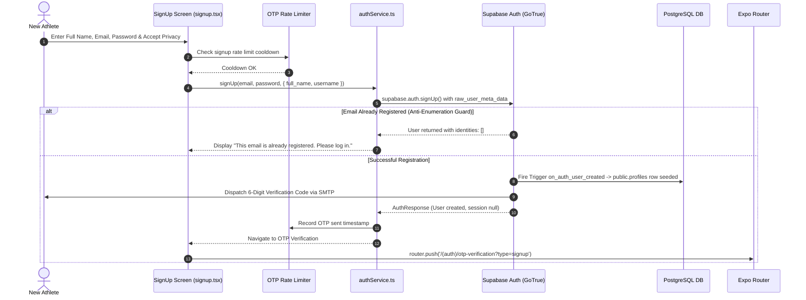
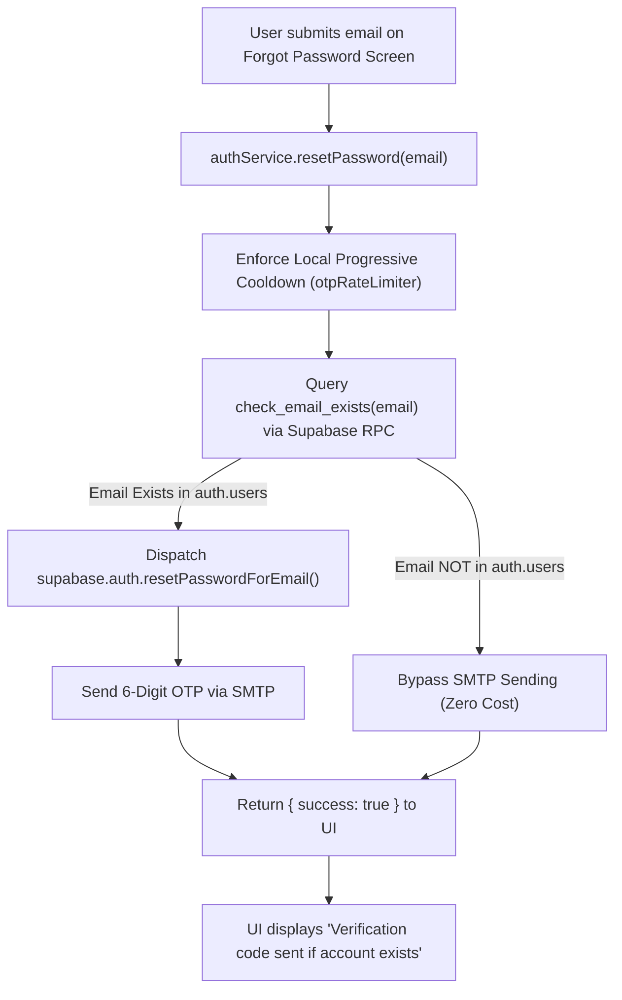

# Authentication, Identity, & SMTP Email Specification

## 1. Authentication Architecture & Supported Flows

Replix utilizes **Supabase Auth (GoTrue)** with **Proof Key for Code Exchange (PKCE)** as its centralized identity provider. Authentication state is synchronized locally via a custom Zustand store (`authStore.ts`) and persisted on-device.

### 1.1 Summary Matrix of Authentication Methods

| Auth Method | Status in Codebase | UI Entry Point | Implementation Mechanism |
| :--- | :--- | :--- | :--- |
| **Email & Password** | **Production Active** | `app/(auth)/signin.tsx`, `signup.tsx` | `supabase.auth.signInWithPassword()`, `supabase.auth.signUp()` |
| **6-Digit OTP Verification** | **Production Active** | `app/(auth)/otp-verification.tsx` | `supabase.auth.verifyOtp()` with `type: 'signup' \| 'recovery'` |
| **Password Recovery** | **Production Active** | `app/(auth)/forgot-password.tsx` | `supabase.auth.resetPasswordForEmail()`, `updateUser({ password })` |
| **Google Sign-In (OAuth)** | **Implemented / Active** | `app/(auth)/welcome.tsx` | `signInWithOAuth({ provider: 'google' })` + `WebBrowser.openAuthSessionAsync` |
| **Apple Sign-In (OAuth)** | **Implemented / Active** | `app/(auth)/welcome.tsx` | `signInWithOAuth({ provider: 'apple' })` + `WebBrowser.openAuthSessionAsync` |

---

### 1.2 User Registration Flow (`signup.tsx`)



---

### 1.3 6-Digit OTP Verification Flow (`otp-verification.tsx`)

The application enforces a 6-digit numeric OTP token verification process:
1. **Auto-Submission**: When the user enters the 6th digit in the input field, `useEffect` detects `code.length === 6` and triggers `handleVerify()` automatically without requiring an extra button press.
2. **Progressive Backoff Resend Limiter (`otpRateLimiter`)**:
   - Tier 1: 60s cooldown
   - Tier 2: 120s cooldown
   - Tier 3: 300s (5m) cooldown
   - Tier 4: 900s (15m) cooldown
   - State is cached in-memory and persisted across back-navigation via `@replix_otp_rate_limits` in `AsyncStorage`.
3. **Verification**: Calls `supabase.auth.verifyOtp({ email, token, type: 'signup' | 'recovery' })`.
   - On `signup`: Sets user session and redirects to `/(tabs)/home`.
   - On `recovery`: Sets `isRecoveringPassword: true` in `useAuthStore` and redirects to `/(auth)/create-new-password`.

---

### 1.4 OAuth Social Authentication (Google & Apple)

Social authentication is implemented using Supabase OAuth with deep-link redirection:

```typescript
// services/user/authService.ts
async signInWithOAuth(provider: "google" | "apple") {
  const redirectTo = Linking.createURL("auth-callback");

  const { data, error } = await supabase.auth.signInWithOAuth({
    provider,
    options: {
      redirectTo,
      skipBrowserRedirect: true,
    },
  });

  if (error) throw error;

  if (data?.url) {
    const result = await WebBrowser.openAuthSessionAsync(data.url, redirectTo);

    if (result.type === "success" && result.url) {
      const parsed = Linking.parse(result.url);
      const code = parsed.queryParams?.code;
      if (code) {
        const { error: exchangeError } = await supabase.auth.exchangeCodeForSession(String(code));
        if (exchangeError) throw exchangeError;
      }
    }
  }
}
```

- **Deep Link Callback Anchor (`app/(auth)/auth-callback.tsx`)**: Acts as a zero-render routing anchor for the custom URL scheme (`replix://auth-callback`). The root layout guard automatically intercepts the authenticated state and routes to the dashboard.

---

## 2. Session Management & Security

### 2.1 Token Lifecycle & Storage Architecture
- **Storage Driver**: `@react-native-async-storage/async-storage` securely stores the Supabase session tokens (Access Token, Refresh Token, User Metadata).
- **PKCE Flow**: Configured with `flowType: "pkce"` in `utils/supabase.ts` for cryptographic security against authorization code interception attacks on mobile devices.
- **Auto Token Refresh**: Handled automatically in the background by the Supabase client runtime (`autoRefreshToken: true`).

```typescript
// utils/supabase.ts
export const supabase = createClient(env.SUPABASE_URL, env.SUPABASE_ANON_KEY, {
  auth: {
    storage: AsyncStorage,
    autoRefreshToken: true,
    persistSession: true,
    detectSessionInUrl: false,
    flowType: "pkce",
  },
  global: {
    fetch: customFetch, // Custom clock-skew retry handler
  }
});
```

### 2.2 Global Clock-Skew Mitigation (`PGRST303`)
If the mobile client device clock drifts from UTC, Supabase Auth tokens can prematurely fail validation. `utils/supabase.ts` wraps all global fetch requests with an automatic retry handler:

```typescript
const customFetch = async (url: RequestInfo | URL, options?: RequestInit): Promise<Response> => {
  let attempt = 0;
  while (attempt < 3) {
    const response = await fetch(url, options);
    if (!response.ok) {
      const clonedResponse = response.clone();
      try {
        const errorText = await clonedResponse.text();
        if (errorText.includes("PGRST303") && attempt < 2) {
          // Clock skew detected: wait 1s and retry request globally
          await new Promise(r => setTimeout(r, 1000));
          attempt++;
          continue;
        }
      } catch (e) {}
    }
    return response;
  }
  return fetch(url, options);
};
```

### 2.3 Route Protection & Navigation Guards (`app/_layout.tsx`)
The root layout monitors `useAuthStore` and current route segments to enforce access boundaries:

```typescript
useEffect(() => {
  if (fontsLoaded && !isLoading) {
    const inAuthGroup = segments[0] === "(auth)";
    const inOnboardingGroup = segments[0] === "(onboarding)";
    const isPhysicalMetrics = segments[0] === "(onboarding)" && segments[1] === "physical-metrics";
    const isAuthCallback = segments[0] === "auth-callback";
    const isCreateNewPassword = (segments as string[]).includes("create-new-password");

    if (isAuthenticated && (inAuthGroup || (inOnboardingGroup && !isPhysicalMetrics) || isAuthCallback) && !isCreateNewPassword) {
      // Authenticated users cannot re-enter login/signup screens
      router.replace("/(tabs)/home" as any);
    } else if (!isAuthenticated && (!inAuthGroup || isAuthCallback) && !inOnboardingGroup && segments[0]) {
      // Unauthenticated users are redirected to the Welcome portal
      router.replace("/(auth)/welcome" as any);
    }
  }
}, [fontsLoaded, isLoading, isAuthenticated, segments]);
```

### 2.4 Complete Logout & State Purging
When `useAuthStore.signOut()` is triggered:
1. `supabase.auth.signOut()` invalidates the refresh token on the server.
2. The active auth subscription listener is unsubscribed to prevent memory leaks.
3. RevenueCat SDK logs out via `Purchases.logOut()`.
4. `clearAllStores()` purges all Zustand stores (`workoutStore`, `historyStore`, `profileStore`, `friendStore`, `leaderboardStore`) to eliminate cross-session data bleeding.

---

## 3. User Identity & RevenueCat Integration

### 3.1 `auth.users` to `public.profiles` Database Synchronization
When a user signs up, the PostgreSQL trigger `on_auth_user_created` fires `public.handle_new_user()` to populate `public.profiles`:

```sql
CREATE OR REPLACE FUNCTION public.handle_new_user()
RETURNS trigger
LANGUAGE plpgsql
SECURITY DEFINER SET search_path = public
AS $$
BEGIN
  INSERT INTO public.profiles (
    id, 
    email, 
    username, 
    full_name, 
    avatar_url
  )
  VALUES (
    NEW.id,
    NEW.email,
    COALESCE(NEW.raw_user_meta_data->>'username', split_part(NEW.email, '@', 1)),
    NEW.raw_user_meta_data->>'full_name',
    NEW.raw_user_meta_data->>'avatar_url'
  );
  RETURN NEW;
END;
$$;
```

### 3.2 RevenueCat Identity Mapping
In `authStore.ts`, the `onAuthStateChange` listener synchronizes the Supabase `user.id` (UUID) with RevenueCat:

```typescript
// store/user/authStore.ts
if ((event === "SIGNED_IN" || event === "INITIAL_SESSION") && newUser?.id) {
  // Sync RevenueCat App User ID with Supabase UUID
  await Purchases.logIn(newUser.id);
  
  // Verify & synchronize live entitlements with the database
  const isPremium = await premiumService.syncEntitlements(newUser.id);
  
  // If entitlement mismatch detected, force-refresh profile
  const currentProfile = useProfileStore.getState().profile;
  if (currentProfile && currentProfile.is_premium !== isPremium) {
    await useProfileStore.getState().fetchProfile(true);
  }
} else if (event === "SIGNED_OUT") {
  if (!(await Purchases.isAnonymous())) {
    await Purchases.logOut();
  }
}
```

---

## 4. SMTP & Transactional Email Communications

### 4.1 Email Infrastructure Configuration
Transactional emails are dispatched via Supabase GoTrue Auth connected to custom SMTP (e.g. Resend, SendGrid, Amazon SES, or Postmark) configured in Supabase Project Settings:
- **Sender Address**: `noreply@yourdomain.com` / `Replix Team <auth@replix.io>`
- **Transport Security**: Port `587` (STARTTLS) or Port `465` (TLS)

### 4.2 Transactional Email Types & Trigger Conditions

| Email Type | Trigger Condition | Code Reference | Template / Payload |
| :--- | :--- | :--- | :--- |
| **Signup Verification** | New user submits registration form | `authService.signUp()` | 6-digit numeric OTP token (`{{ .Token }}`) |
| **Password Reset OTP** | User requests password recovery | `authService.resetPassword()` | 6-digit recovery OTP code (`{{ .Token }}`) |
| **Resend Code** | User taps "Resend Code" in verification screen | `authService.resendOtp()` | Refreshed 6-digit OTP token |
| **Magic Link / OAuth Confirm** | Social login or magic link dispatch | `authService.signInWithOAuth()` | Confirmation URL with PKCE auth code |

---

### 4.3 Anti-Enumeration & Cost-Saving Email Shield (`check_email_exists`)

To protect user privacy and prevent wasting SMTP sending quotas on fraudulent or non-existent email requests, `authService.resetPassword()` employs a dual-layer security check:



1. **RPC Check**: Calls `public.check_email_exists(email)` (`SECURITY DEFINER` function checking `auth.users`).
2. **Quota Optimization**: If the email does not exist, the SMTP request is skipped entirely, saving email service credits.
3. **Enumeration Protection**: The client UI displays an identical success notification regardless of whether the email was registered, preventing attackers from probing valid accounts.
