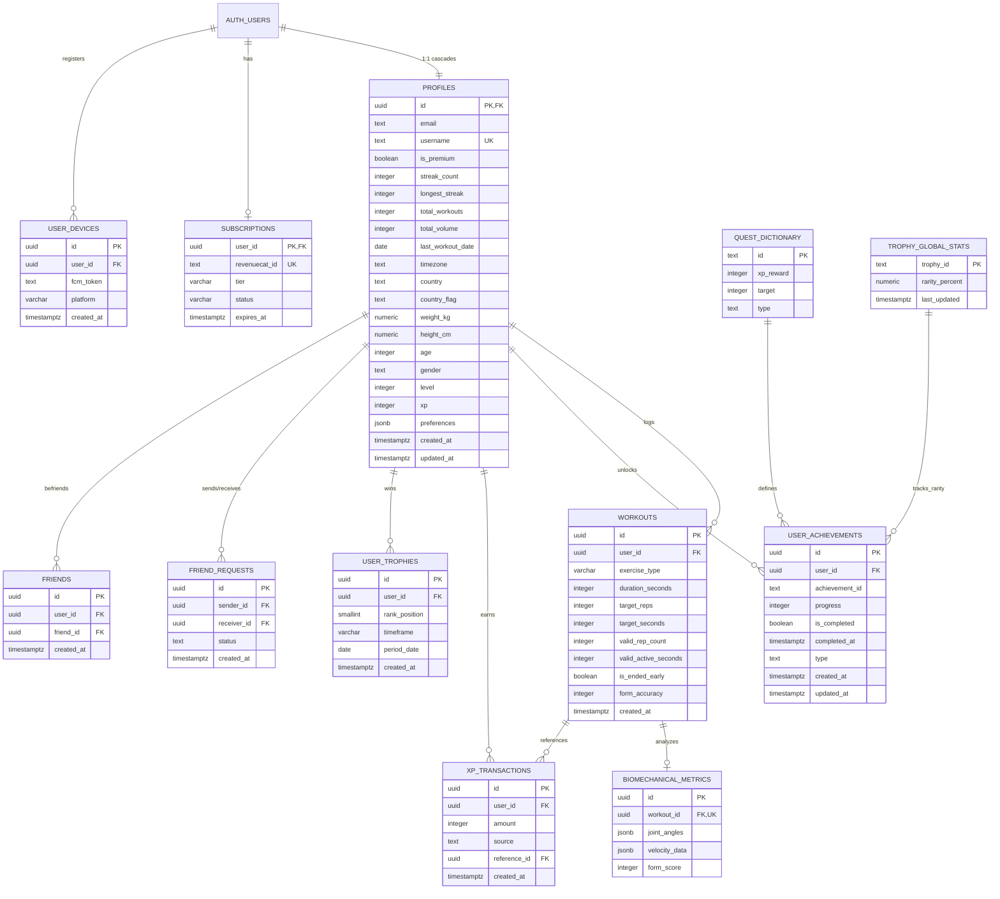

# Database Schema & Row Level Security (RLS) Specification

## 1. High-Level Database Overview

The application utilizes **Supabase (PostgreSQL 15+)** as its primary cloud data store. The database architecture is built around user-centric fitness tracking, real-time gamification, social interaction, push notifications, and subscription entitlement management.

### Architectural Tenets
1. **Auth & Identity Synchronization**: User identity originates in Supabase `auth.users`. When a user signs up, a PostgreSQL trigger (`on_auth_user_created`) automatically populates the `public.profiles` table with default values, user metadata, and timezone configurations.
2. **Entitlement & Paywall Enforcement**: Subscriptions are synced via RevenueCat webhooks (`rc-webhook` Supabase Edge Function) directly into `public.subscriptions`. Row Level Security (RLS) and stored procedures gate historical workout data (free users access current month only; Pro users access full history) and analytics range views (`month`/`year`).
3. **Atomic Gamification Engine**: Workout logging, XP point generation, anti-cheat validation, and streak calculations are managed atomically through server-side PostgreSQL functions (`log_workout_session`, `update_user_aggregates`).
4. **Social & Push Notification Webhooks**: Friend request events and mutual friend acceptances trigger asynchronous HTTP webhooks via `pg_net` to Supabase Edge Functions (`push-notification`, `notify-friend-accepted`), which dispatch notifications via Expo Push Notification servers.
5. **Scheduled Maintenance Jobs**: PostgreSQL cron extension (`pg_cron`) runs automated recurring batch jobs at UTC midnight to recalculate global trophy rarity and mint podium trophies for weekly and monthly leaderboard winners.

---

## 2. Entity Relationship Diagram (ERD)



---

## 3. Data Dictionary (Tables & Columns)

### 3.1 `profiles`
Primary user profile table representing identity, stats, RPG levels, physical attributes, and cloud settings.

| Column Name | Data Type | PK/FK | Nullable | Default Value | Description / Constraints |
| :--- | :--- | :--- | :--- | :--- | :--- |
| `id` | `UUID` | **PK**, **FK** | **No** | None | References `auth.users(id)` ON DELETE CASCADE |
| `email` | `TEXT` | - | **No** | None | User email copied at signup trigger |
| `username` | `TEXT` | **UK** | Yes | `NULL` | Public unique display handle (`UNIQUE`, case-insensitive index) |
| `full_name` | `TEXT` | - | Yes | `NULL` | Optional user full name |
| `avatar_url` | `TEXT` | - | Yes | `NULL` | CDN URL to avatar stored in Supabase Storage `avatars` bucket |
| `is_premium` | `BOOLEAN` | - | **No** | `false` | Cached Pro entitlement status (synced from RevenueCat) |
| `streak_count` | `INTEGER` | - | **No** | `0` | Current active consecutive day streak |
| `longest_streak` | `INTEGER` | - | **No** | `0` | All-time highest consecutive day workout streak |
| `total_workouts` | `INTEGER` | - | **No** | `0` | Lifetime completed workout session count |
| `total_volume` | `INTEGER` | - | **No** | `0` | All-time aggregate valid reps completed |
| `last_workout_date` | `DATE` | - | Yes | `NULL` | Date of most recent completed workout in user's timezone |
| `organization_id` | `UUID` | - | Yes | `NULL` | Optional multi-tenant B2B organization identifier |
| `timezone` | `TEXT` | - | **No** | `'Asia/Karachi'` | IANA timezone string for midnight streak rollbacks |
| `country` | `TEXT` | - | Yes | `NULL` | Country name (e.g. "United States") |
| `country_flag` | `TEXT` | - | Yes | `NULL` | Country flag emoji / ISO code (e.g. "🇺🇸") |
| `weight_kg` | `NUMERIC` | - | Yes | `NULL` | User body weight in kilograms |
| `height_cm` | `NUMERIC` | - | Yes | `NULL` | User height in centimeters |
| `age` | `INTEGER` | - | Yes | `NULL` | User age in years |
| `gender` | `TEXT` | - | Yes | `NULL` | User gender ('male', 'female', 'other', 'prefer_not_to_say') |
| `level` | `INTEGER` | - | **No** | `1` | RPG Gamification Level (derived from XP curve) |
| `xp` | `INTEGER` | - | **No** | `0` | All-time earned XP points |
| `total_score` | `INTEGER` | - | **No** | `0` | Legacy score field (synced with XP) |
| `fcm_token` | `TEXT` | - | Yes | `NULL` | Legacy single-token column (deprecated in favor of `user_devices`) |
| `preferences` | `JSONB` | - | **No** | `'{}'::jsonb` | Cloud settings (targets: `pushup_target`, `squat_target`, `plank_target`, `voiceCoach`) |
| `created_at` | `TIMESTAMPTZ` | - | **No** | `NOW()` | Record creation timestamp |
| `updated_at` | `TIMESTAMPTZ` | - | **No** | `NOW()` | Record modification timestamp |

---

### 3.2 `workouts`
Logs individual AI-tracked workout sessions.

| Column Name | Data Type | PK/FK | Nullable | Default Value | Description / Constraints |
| :--- | :--- | :--- | :--- | :--- | :--- |
| `id` | `UUID` | **PK** | **No** | `uuid_generate_v4()` | Unique session identifier |
| `user_id` | `UUID` | **FK** | **No** | None | References `auth.users(id)` ON DELETE CASCADE |
| `exercise_type` | `VARCHAR(50)` | - | **No** | None | `CHECK (exercise_type IN ('pushup', 'squat', 'plank', 'pullup', 'situp', 'lunge', 'burpee'))` |
| `duration_seconds` | `INTEGER` | - | **No** | `0` | Total session duration in seconds (`CHECK (duration_seconds >= 0)`) |
| `target_reps` | `INTEGER` | - | **No** | `0` | Target repetition count set before session |
| `target_seconds` | `INTEGER` | - | **No** | `0` | Target duration set for isometric exercises (e.g., plank) |
| `valid_rep_count` | `INTEGER` | - | **No** | `0` | Computer vision verified rep count |
| `valid_active_seconds` | `INTEGER` | - | **No** | `0` | Computer vision verified active time in proper form |
| `is_ended_early` | `BOOLEAN` | - | **No** | `false` | Flag indicating user terminated session before hitting target |
| `form_accuracy` | `INTEGER` | - | **No** | `0` | Aggregate biomechanical form score (0-100%) |
| `created_at` | `TIMESTAMPTZ` | - | **No** | `NOW()` | Session completion timestamp (Indexed for leaderboard & RLS) |

---

### 3.3 `user_devices`
Stores multi-device Expo Push / FCM push tokens per user.

| Column Name | Data Type | PK/FK | Nullable | Default Value | Description / Constraints |
| :--- | :--- | :--- | :--- | :--- | :--- |
| `id` | `UUID` | **PK** | **No** | `uuid_generate_v4()` | Primary key |
| `user_id` | `UUID` | **FK** | **No** | None | References `auth.users(id)` ON DELETE CASCADE |
| `fcm_token` | `TEXT` | - | **No** | None | Expo push token string (`ExponentPushToken[...]`) |
| `platform` | `VARCHAR(10)` | - | **No** | None | Client OS (`CHECK (platform IN ('ios', 'android'))`) |
| `created_at` | `TIMESTAMPTZ` | - | **No** | `NOW()` | Registration timestamp |

*Constraints*: `CONSTRAINT uq_user_fcm_token UNIQUE (user_id, fcm_token)`

---

### 3.4 `subscriptions`
RevenueCat purchase and subscription ledger.

| Column Name | Data Type | PK/FK | Nullable | Default Value | Description / Constraints |
| :--- | :--- | :--- | :--- | :--- | :--- |
| `user_id` | `UUID` | **PK**, **FK** | **No** | None | References `auth.users(id)` ON DELETE CASCADE |
| `revenuecat_id` | `TEXT` | **UK** | Yes | `NULL` | RevenueCat original transaction or customer ID |
| `tier` | `VARCHAR(20)` | - | **No** | None | Product tier (e.g. `'pro'`, `'replix_annual'`, `'replix_monthly'`) |
| `status` | `VARCHAR(20)` | - | **No** | None | Subscription state (`'active'`, `'cancelled'`, `'expired'`) |
| `expires_at` | `TIMESTAMPTZ` | - | Yes | `NULL` | Entitlement expiration timestamp |

---

### 3.5 `friend_requests`
Social graph connection requests.

| Column Name | Data Type | PK/FK | Nullable | Default Value | Description / Constraints |
| :--- | :--- | :--- | :--- | :--- | :--- |
| `id` | `UUID` | **PK** | **No** | `uuid_generate_v4()` | Request identifier |
| `sender_id` | `UUID` | **FK** | **No** | None | References `public.profiles(id)` ON DELETE CASCADE |
| `receiver_id` | `UUID` | **FK** | **No** | None | References `public.profiles(id)` ON DELETE CASCADE |
| `status` | `TEXT` | - | **No** | `'pending'` | Request state (`'pending'`, `'accepted'`, `'declined'`) |
| `created_at` | `TIMESTAMPTZ` | - | **No** | `NOW()` | Timestamp request was dispatched |

*Constraints*: `UNIQUE(sender_id, receiver_id)`

---

### 3.6 `friends`
Bidirectional mutual friendship links.

| Column Name | Data Type | PK/FK | Nullable | Default Value | Description / Constraints |
| :--- | :--- | :--- | :--- | :--- | :--- |
| `id` | `UUID` | **PK** | **No** | `uuid_generate_v4()` | Connection row ID |
| `user_id` | `UUID` | **FK** | **No** | None | References `public.profiles(id)` ON DELETE CASCADE |
| `friend_id` | `UUID` | **FK** | **No** | None | References `public.profiles(id)` ON DELETE CASCADE |
| `created_at` | `TIMESTAMPTZ` | - | **No** | `NOW()` | Timestamp connection was created |

*Constraints*: `UNIQUE(user_id, friend_id)` (Dual symmetric rows stored: `(A, B)` and `(B, A)`).

---

### 3.7 `user_achievements`
Tracks progress and completions for quests, badges, and permanent trophies.

| Column Name | Data Type | PK/FK | Nullable | Default Value | Description / Constraints |
| :--- | :--- | :--- | :--- | :--- | :--- |
| `id` | `UUID` | **PK** | **No** | `gen_random_uuid()` | Achievement tracking ID |
| `user_id` | `UUID` | **FK** | **No** | None | References `public.profiles(id)` ON DELETE CASCADE |
| `achievement_id` | `TEXT` | - | **No** | None | Quest/Trophy identifier string (e.g. `'morning_routine'`) |
| `progress` | `INTEGER` | - | **No** | `0` | Current completed rep/seconds count towards quest target |
| `is_completed` | `BOOLEAN` | - | **No** | `false` | True if reward has been claimed or target achieved |
| `completed_at` | `TIMESTAMPTZ` | - | Yes | `NULL` | Completion timestamp |
| `type` | `TEXT` | - | **No** | None | Scope category (`'daily'`, `'medium'`, `'hard'`, `'lifetime'`, `'trophy'`) |
| `created_at` | `TIMESTAMPTZ` | - | **No** | `NOW()` | Record creation timestamp |
| `updated_at` | `TIMESTAMPTZ` | - | **No** | `NOW()` | Last progress update timestamp |

*Constraints*: `UNIQUE (user_id, achievement_id)`

---

### 3.8 `xp_transactions`
Append-only immutable ledger recording all XP grants.

| Column Name | Data Type | PK/FK | Nullable | Default Value | Description / Constraints |
| :--- | :--- | :--- | :--- | :--- | :--- |
| `id` | `UUID` | **PK** | **No** | `gen_random_uuid()` | Unique transaction ID |
| `user_id` | `UUID` | **FK** | **No** | None | References `public.profiles(id)` ON DELETE CASCADE |
| `amount` | `INTEGER` | - | **No** | None | Delta XP awarded (positive integer) |
| `source` | `TEXT` | - | **No** | None | Source identifier (e.g. `'workout'`, `'streak_bonus'`, `'quest_quick_pump'`) |
| `reference_id` | `UUID` | **FK** | Yes | `NULL` | Optional reference to originating `workouts(id)` (indexed via `idx_xp_transactions_reference_id` for fast idempotent lookups) |
| `created_at` | `TIMESTAMPTZ` | - | **No** | `NOW()` | Award timestamp (indexed for weekly/monthly leaderboard queries) |

---

### 3.9 `user_trophies`
Minted podium trophies awarded to top 3 global athletes in weekly and monthly cycles.

| Column Name | Data Type | PK/FK | Nullable | Default Value | Description / Constraints |
| :--- | :--- | :--- | :--- | :--- | :--- |
| `id` | `UUID` | **PK** | **No** | `gen_random_uuid()` | Trophy record ID |
| `user_id` | `UUID` | **FK** | **No** | None | References `public.profiles(id)` ON DELETE CASCADE |
| `rank_position` | `SMALLINT` | - | **No** | None | Podium rank (`CHECK (rank_position IN (1, 2, 3))`) |
| `timeframe` | `VARCHAR(10)` | - | **No** | `'weekly'` | Competition period (`CHECK (timeframe IN ('weekly', 'monthly'))`) |
| `period_date` | `DATE` | - | **No** | None | Start date of the contested period |
| `created_at` | `TIMESTAMPTZ` | - | **No** | `NOW()` | Date awarded by `pg_cron` |

*Constraints*: `UNIQUE (user_id, timeframe, period_date)`

---

### 3.10 `trophy_global_stats`
Global trophy rarity index computed across all registered users.

| Column Name | Data Type | PK/FK | Nullable | Default Value | Description / Constraints |
| :--- | :--- | :--- | :--- | :--- | :--- |
| `trophy_id` | `TEXT` | **PK** | **No** | None | Trophy identifier string |
| `rarity_percent` | `NUMERIC(5,2)` | - | **No** | `0.00` | Percentage of active users who unlocked this trophy |
| `last_updated` | `TIMESTAMPTZ` | - | **No** | `NOW()` | Timestamp of last recalculation cron |

---

### 3.11 `quest_dictionary`
System dictionary of quests, targets, and rewards.

| Column Name | Data Type | PK/FK | Nullable | Default Value | Description / Constraints |
| :--- | :--- | :--- | :--- | :--- | :--- |
| `id` | `TEXT` | **PK** | **No** | None | Quest key (e.g. `'morning_routine'`, `'iron_core'`) |
| `xp_reward` | `INTEGER` | - | **No** | None | XP awarded on completion |
| `target` | `INTEGER` | - | **No** | None | Rep or second target |
| `type` | `TEXT` | - | **No** | None | Interval type (`'daily'`, `'medium'`, `'hard'`, `'lifetime'`) |

---

### 3.12 `biomechanical_metrics`
Detailed joint angles and velocity telemetry from CV tracking sessions.

| Column Name | Data Type | PK/FK | Nullable | Default Value | Description / Constraints |
| :--- | :--- | :--- | :--- | :--- | :--- |
| `id` | `UUID` | **PK** | **No** | `uuid_generate_v4()` | Metrics record ID |
| `workout_id` | `UUID` | **FK**, **UK** | **No** | None | References `public.workouts(id)` ON DELETE CASCADE |
| `joint_angles` | `JSONB` | - | Yes | `NULL` | Biomechanical joint telemetry (e.g. elbow, knee, hip angles) |
| `velocity_data` | `JSONB` | - | Yes | `NULL` | Rep velocity and acceleration arrays |
| `form_score` | `INTEGER` | - | Yes | `NULL` | Calculated overall biomechanical form score (0-100) |

---

## 4. Row Level Security (RLS) Policies

All tables in the database have Row Level Security explicitly enabled (`ALTER TABLE ... ENABLE ROW LEVEL SECURITY;`).

```
+------------------------+-------------+--------------------------------------------------------------+
| Table                  | Command     | Policy Rule / Condition                                      |
+------------------------+-------------+--------------------------------------------------------------+
| profiles               | SELECT      | true (Publicly viewable for leaderboard, search, friends)     |
| profiles               | INSERT      | auth.uid() = id                                              |
| profiles               | UPDATE      | auth.uid() = id (WITH CHECK auth.uid() = id)                 |
| profiles               | DELETE      | Restricted (Cascade on auth.users deletion)                  |
+------------------------+-------------+--------------------------------------------------------------+
| workouts               | SELECT      | auth.uid() = user_id AND (created_at >= month_start OR Pro)  |
| workouts               | INSERT      | auth.uid() = user_id                                         |
| workouts               | UPDATE      | auth.uid() = user_id (WITH CHECK auth.uid() = user_id)       |
| workouts               | DELETE      | auth.uid() = user_id                                         |
+------------------------+-------------+--------------------------------------------------------------+
| subscriptions          | SELECT      | auth.uid() = user_id                                         |
| subscriptions          | INSERT/UPD  | Managed by Edge Function service_role / restricted           |
+------------------------+-------------+--------------------------------------------------------------+
| user_devices           | ALL         | auth.uid() = user_id (WITH CHECK auth.uid() = user_id)       |
+------------------------+-------------+--------------------------------------------------------------+
| friend_requests        | SELECT      | auth.uid() = sender_id OR auth.uid() = receiver_id          |
| friend_requests        | INSERT      | auth.uid() = sender_id                                       |
| friend_requests        | DELETE      | auth.uid() = sender_id OR auth.uid() = receiver_id          |
+------------------------+-------------+--------------------------------------------------------------+
| friends                | SELECT      | auth.uid() = user_id OR auth.uid() = friend_id               |
| friends                | ALL         | auth.uid() = user_id OR auth.uid() = friend_id               |
+------------------------+-------------+--------------------------------------------------------------+
| user_achievements      | SELECT      | auth.uid() = user_id                                         |
| user_achievements      | INSERT      | auth.uid() = user_id                                         |
| user_achievements      | UPDATE      | auth.uid() = user_id                                         |
+------------------------+-------------+--------------------------------------------------------------+
| xp_transactions        | SELECT      | true (Public for leaderboard timeframe aggregations)         |
| xp_transactions        | INSERT      | auth.uid() = user_id (or via SECURITY DEFINER RPC)          |
+------------------------+-------------+--------------------------------------------------------------+
| trophy_global_stats    | SELECT      | true (Anyone can read rarity metrics)                        |
| trophy_global_stats    | INSERT/UPD  | Restricted to SECURITY DEFINER cron procedures               |
+------------------------+-------------+--------------------------------------------------------------+
| user_trophies          | SELECT      | true (Publicly viewable showcase on profiles)               |
| user_trophies          | INSERT/UPD  | Restricted to process_weekly_trophies cron procedure         |
+------------------------+-------------+--------------------------------------------------------------+
| storage.objects        | SELECT      | bucket_id = 'avatars' (Public)                               |
| (avatars bucket)       | INSERT/UPD  | bucket_id = 'avatars' AND auth.uid()::text = folder_name    |
+------------------------+-------------+--------------------------------------------------------------+
```

### Detailed RLS Logic & Security Gating

#### 1. `profiles`
```sql
CREATE POLICY "Public profiles viewable by everyone" 
  ON public.profiles FOR SELECT 
  USING (true);

CREATE POLICY "Users can update own profile" 
  ON public.profiles FOR UPDATE 
  USING (auth.uid() = id) 
  WITH CHECK (auth.uid() = id);

CREATE POLICY "Users can insert own profile" 
  ON public.profiles FOR INSERT 
  WITH CHECK (auth.uid() = id);
```
- **Analysis**: Unauthenticated (`anon`) and authenticated users can query basic profile data for leaderboard and social search. Only the authenticated owner (`auth.uid() = id`) can update or insert their record.

#### 2. `workouts` (Pro Tier Paywall Gate)
```sql
CREATE POLICY "Workouts access policy based on subscription" ON public.workouts
FOR SELECT
TO authenticated
USING (
  auth.uid() = user_id
  AND (
    created_at >= date_trunc('month', now())
    OR (SELECT public.is_active_pro(auth.uid()))
  )
);

CREATE POLICY "Users can insert own workouts" ON workouts FOR INSERT TO authenticated WITH CHECK (auth.uid() = user_id);
CREATE POLICY "Users can update own workouts" ON workouts FOR UPDATE TO authenticated USING (auth.uid() = user_id) WITH CHECK (auth.uid() = user_id);
CREATE POLICY "Users can delete own workouts" ON workouts FOR DELETE TO authenticated USING (auth.uid() = user_id);
```
- **Analysis**: Implements the architectural business rule where free users are restricted to viewing workouts from the current calendar month (`created_at >= date_trunc('month', now())`). Full historical lifetime access requires `is_active_pro(auth.uid()) = true`.

#### 3. `subscriptions`
```sql
CREATE POLICY "Users can read own subscription" 
  ON public.subscriptions FOR SELECT 
  USING (auth.uid() = user_id);
```
- **Analysis**: Users can inspect their current subscription expiration and tier. Writes are restricted; modifications are executed by the `rc-webhook` Edge function using `SUPABASE_SERVICE_ROLE_KEY` to prevent client spoofing.

#### 4. `user_devices`
```sql
CREATE POLICY "Users can manage their own devices" 
  ON public.user_devices FOR ALL 
  USING (auth.uid() = user_id) 
  WITH CHECK (auth.uid() = user_id);
```
- **Analysis**: Strict device token ownership. Users can only register, read, or delete FCM tokens linked directly to their `auth.uid()`.

#### 5. `friends` & `friend_requests`
```sql
CREATE POLICY "Users can see requests" 
  ON public.friend_requests FOR SELECT 
  USING (auth.uid() = sender_id OR auth.uid() = receiver_id);

CREATE POLICY "Users can send requests" 
  ON public.friend_requests FOR INSERT 
  WITH CHECK (auth.uid() = sender_id);

CREATE POLICY "Users can delete requests" 
  ON public.friend_requests FOR DELETE 
  USING (auth.uid() = sender_id OR auth.uid() = receiver_id);

CREATE POLICY "Users can view friends" 
  ON public.friends FOR SELECT 
  USING (auth.uid() = user_id OR auth.uid() = friend_id);

CREATE POLICY "Users can manage friends" 
  ON public.friends FOR ALL 
  USING (auth.uid() = user_id OR auth.uid() = friend_id) 
  WITH CHECK (auth.uid() = user_id OR auth.uid() = friend_id);
```
- **Analysis**: Friendship data is strictly scoped to the two participating user IDs. Mutual friendship deletion is backed by the `remove_friend(target_friend_id)` SECURITY DEFINER RPC to ensure both directions are deleted atomically.

---

## 5. Triggers, Functions, & Stored Procedures (RPCs)

### 5.1 System Triggers

| Trigger Name | Target Table | Timing | Event | Procedure | Description |
| :--- | :--- | :--- | :--- | :--- | :--- |
| `on_auth_user_created` | `auth.users` | `AFTER` | `INSERT` | `public.handle_new_user()` | Automatically seeds `public.profiles` on Supabase Auth signup. |
| `on_workout_completed` | `public.workouts` | `AFTER` | `INSERT` | `public.update_user_aggregates()` | Atomically calculates streaks, longest streak, total volume, and updates user profile stats with row-level locks. |
| `on_friend_request_insert` | `public.friend_requests` | `AFTER` | `INSERT` | `public.trigger_push_notification_webhook()` | Invokes Supabase Edge Function `push-notification` via `pg_net` to send push notification to receiver. |
| `on_friend_insert` | `public.friends` | `AFTER` | `INSERT` | `public.trigger_notify_friend_accepted_webhook()` | Dispatches push notification to original requester when a friend request is accepted. |

---

### 5.2 Key Stored Procedures & RPCs

#### 1. `is_active_pro(user_uuid uuid) -> boolean`
- **Security Mode**: `SECURITY DEFINER`
- **Purpose**: Evaluates whether a user has an active Pro entitlement by checking `profiles.is_premium = true` or `subscriptions.expires_at > now()`.

```sql
CREATE OR REPLACE FUNCTION public.is_active_pro(user_uuid uuid)
RETURNS boolean
LANGUAGE plpgsql
SECURITY DEFINER
SET search_path = ''
AS $$
BEGIN
  RETURN EXISTS (
    SELECT 1 FROM public.profiles WHERE id = user_uuid AND is_premium = true
    UNION ALL
    SELECT 1 FROM public.subscriptions WHERE user_id = user_uuid AND (status != 'expired') AND (expires_at IS NULL OR expires_at > now())
  );
END;
$$;
```

#### 2. `update_user_aggregates()` (Atomic Streak Calculation Trigger)
- **Security Mode**: `SECURITY DEFINER`
- **Purpose**: Employs `FOR UPDATE` row-level locking on `profiles` to eliminate concurrency race conditions. Converts UTC workout timestamps to the user's localized timezone (`COALESCE(timezone, 'Asia/Karachi')`) and evaluates consecutive day continuity.

```sql
CREATE OR REPLACE FUNCTION public.update_user_aggregates()
RETURNS TRIGGER AS $$
DECLARE
  v_profile RECORD;
  v_user_tz TEXT;
  local_new_date DATE;
  v_new_streak INT;
  v_new_longest INT;
BEGIN
  SELECT streak_count, longest_streak, total_workouts, total_volume, last_workout_date, COALESCE(timezone, 'Asia/Karachi') as user_tz
  INTO v_profile
  FROM public.profiles
  WHERE id = NEW.user_id
  FOR UPDATE;

  IF NOT FOUND THEN
    RETURN NEW;
  END IF;

  v_user_tz := v_profile.user_tz;
  local_new_date := (NEW.created_at AT TIME ZONE v_user_tz)::DATE;
  v_new_streak := COALESCE(v_profile.streak_count, 0);
  v_new_longest := COALESCE(v_profile.longest_streak, 0);

  IF v_profile.last_workout_date IS NULL THEN
    v_new_streak := 1;
  ELSIF local_new_date = v_profile.last_workout_date THEN
    IF v_new_streak = 0 THEN v_new_streak := 1; END IF;
  ELSIF local_new_date = (v_profile.last_workout_date + INTERVAL '1 day')::DATE THEN
    v_new_streak := v_new_streak + 1;
  ELSIF local_new_date > (v_profile.last_workout_date + INTERVAL '1 day')::DATE THEN
    v_new_streak := 1;
  END IF;

  v_new_longest := GREATEST(v_new_longest, v_new_streak);

  UPDATE public.profiles
  SET 
    total_workouts = COALESCE(total_workouts, 0) + 1,
    total_volume = COALESCE(total_volume, 0) + COALESCE(NEW.valid_rep_count, 0),
    streak_count = v_new_streak,
    longest_streak = v_new_longest,
    last_workout_date = local_new_date,
    updated_at = NOW()
  WHERE id = NEW.user_id;

  RETURN NEW;
END;
$$ LANGUAGE plpgsql SECURITY DEFINER;
```

#### 3. `log_workout_session(...)`
- **Security Mode**: `SECURITY DEFINER`
- **Purpose**: Atomically handles workout session logging, client UUID idempotency, historical timestamp reconciliation, dynamic multipliers, streak milestone bonus XP awards, immutable ledger recording, and profile XP / level updates.
- **Parameters**:
  - `p_exercise_type VARCHAR(50)`: Exercise key (`'pushup'`, `'squat'`, `'plank'`, etc.).
  - `p_duration_seconds INTEGER`: Total elapsed workout duration.
  - `p_target_reps INTEGER`: Target rep count (0 if isometric).
  - `p_target_seconds INTEGER`: Target duration (0 if rep-based).
  - `p_valid_rep_count INTEGER`: Verified form rep count.
  - `p_valid_active_seconds INTEGER`: Verified active hold seconds.
  - `p_is_ended_early BOOLEAN`: Whether session was stopped early.
  - `p_form_accuracy INTEGER`: Aggregate form score (0-100%).
  - `p_form_breakdowns JSONB`: Biomechanical metric breakdown telemetry.
  - `p_workout_id UUID DEFAULT NULL`: Optional client-provided UUID for offline sync idempotency.
  - `p_created_at TIMESTAMPTZ DEFAULT NULL`: Optional client-provided completion timestamp.
- **Key Mechanics**:
  1. **Idempotency Guard**: If `p_workout_id` is provided and already exists in `workouts`, the procedure safely short-circuits and returns current profile stats (`xp_earned: 0`, `is_idempotent_duplicate: true`) without double-counting XP or streak increments.
  2. **Timestamp Validation**: Validates `p_created_at` against clock tampering: rejects dates more than 1 hour in the future or older than 90 days (`ERRCODE_DATA_EXCEPTION`).
  3. **Historical Streak & Trigger Execution**: The workout is inserted with `created_at = v_workout_created_at`, firing the `on_workout_completed` trigger to update streak continuity for the exact calendar date the workout was performed.
  4. **Dynamic RPG Level Calculation**: Uses `calculate_level_from_xp(p_xp)` helper to deterministically sync user level on every XP transaction.
  5. **Ledger Audit Trail**: Records XP gains in `xp_transactions` with `reference_id = v_workout_id`.

#### 4. `get_statistics_range_data(p_user_id, p_range, p_offset)`
- **Security Mode**: `SECURITY DEFINER`
- **Purpose**: Aggregates workout statistics (reps, sets, volume, accuracy trends, exercise breakdowns) for `'week'`, `'month'`, and `'year'`. Gates `'month'` and `'year'` behind `is_active_pro(p_user_id)`.

#### 5. Leaderboard Pagination RPCs
- `get_paginated_all_time(page_number, page_size)`
- `get_user_rank_all_time(target_user_id)`
- `get_paginated_weekly(page_number, page_size, offset_weeks)`
- `get_user_rank_weekly(target_user_id, offset_weeks)`
- `get_paginated_monthly(page_number, page_size, offset_months)`
- `get_user_rank_monthly(target_user_id, offset_months)`
- **Purpose**: Compute high-performance windowed rankings using `RANK() OVER (ORDER BY ...)` over `profiles` and aggregate sums from `xp_transactions`.

#### 6. `check_email_exists(check_email text) -> boolean`
- **Security Mode**: `SECURITY DEFINER` (Granted to `anon`, `authenticated`, `service_role`)
- **Purpose**: Allows frontend authentication flows to verify email availability without exposing auth tables or leaking user metadata.

#### 7. `remove_friend(target_friend_id UUID) -> void`
- **Security Mode**: `SECURITY DEFINER`
- **Purpose**: Securely executes bidirectional deletion of friendship rows where `(user_id = auth.uid() AND friend_id = target) OR (user_id = target AND friend_id = auth.uid())`.

---

### 5.3 Automated Cron Schedules (`pg_cron`)

| Cron Job Identifier | Schedule (Cron Expression) | Target Function | Purpose |
| :--- | :--- | :--- | :--- |
| `nightly-trophy-rarity-update` | `0 0 * * *` (Daily at 00:00 UTC) | `update_trophy_rarity()` | Computes percentage of total users possessing each trophy and updates `trophy_global_stats`. |
| `process_weekly_trophies_job` | `1 0 * * 1` (Mondays at 00:01 UTC) | `process_weekly_trophies()` | Awards Gold (1st), Silver (2nd), and Bronze (3rd) trophies to the previous week's top 3 XP earners. |
| `process_monthly_trophies_job` | `5 0 1 * *` (1st of month at 00:05 UTC) | `process_monthly_trophies()` | Awards monthly podium trophies to top 3 global XP earners for the preceding month. |

---

## 6. Performance Indexes

| Index Name | Table | Target Columns | Primary Optimization Purpose |
| :--- | :--- | :--- | :--- |
| `idx_workouts_user_id` | `workouts` | `(user_id)` | Fast lookup of user workout history and dashboard stats |
| `idx_workouts_created_at` | `workouts` | `(created_at DESC)` | Time-filtered history, monthly RLS check, and range queries |
| `idx_profiles_total_volume` | `profiles` | `(total_volume DESC)` | All-time total volume leaderboard sorting |
| `idx_profiles_username_lower` | `profiles` | `(LOWER(username))` | Case-insensitive friend search and username uniqueness validation |
| `idx_xp_transactions_user_date` | `xp_transactions` | `(user_id, created_at)` | Timeframe-scoped XP aggregations per user (weekly/monthly) |
| `idx_xp_transactions_created_at` | `xp_transactions` | `(created_at)` | Global weekly and monthly leaderboard ranking computations |
| `idx_xp_transactions_reference_id` | `xp_transactions` | `(reference_id)` | Fast foreign key joins and $O(1)$ idempotent sync deduplication |
| `idx_subscriptions_user_status_expiry` | `subscriptions` | `(user_id, status, expires_at)` | Accelerates `is_active_pro()` RLS subqueries on workout select |
| `idx_user_trophies_user_id` | `user_trophies` | `(user_id)` | Fast profile trophy showcase rendering |
| `idx_user_trophies_timeframe` | `user_trophies` | `(user_id, timeframe)` | Filtered user trophy lookups by period |
