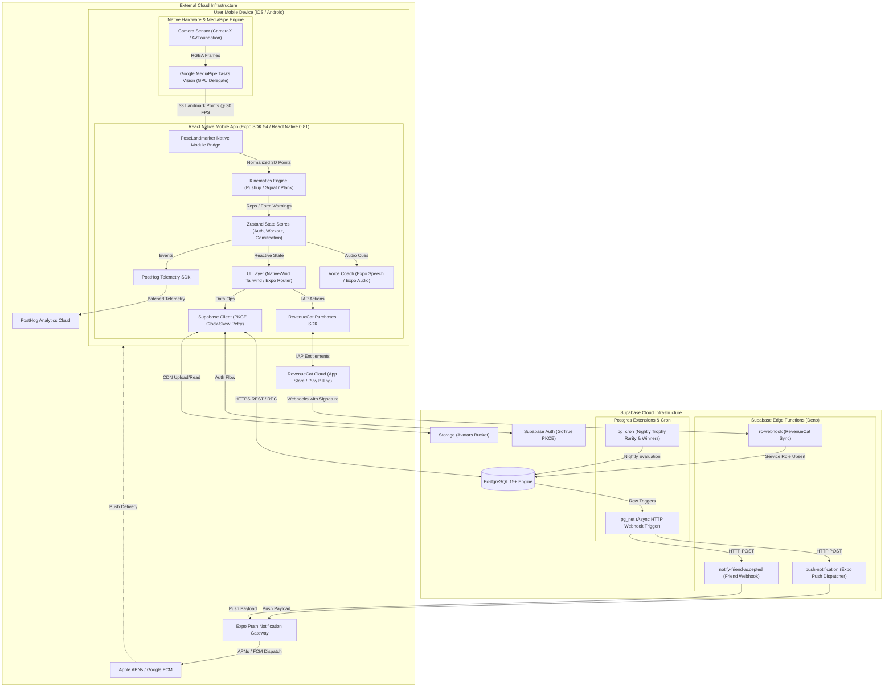
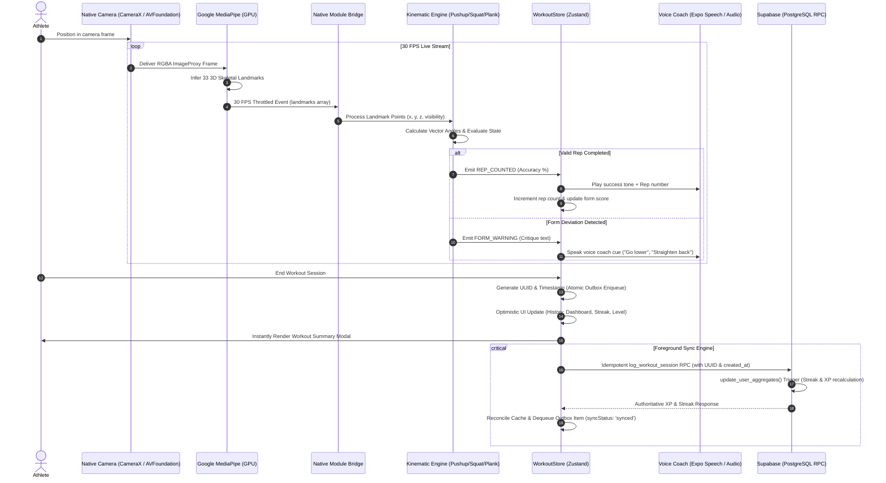
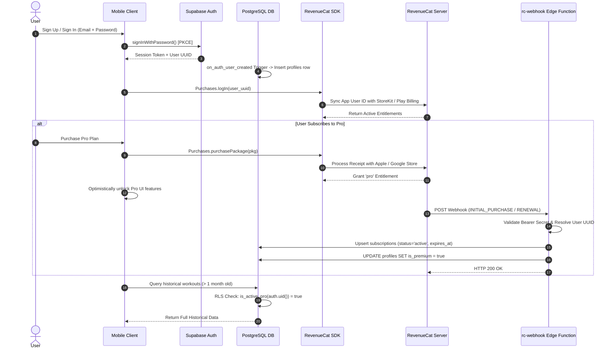
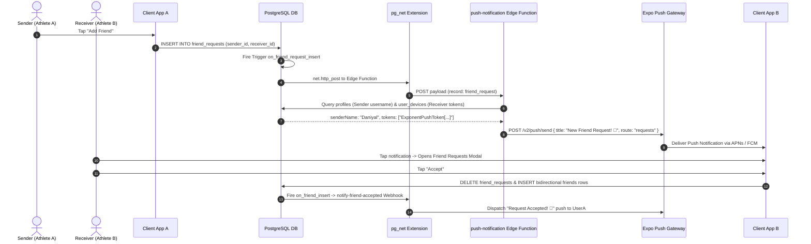

# System Architecture Specification

## 1. Executive Summary

**Replix** is an AI-powered, vision-driven mobile fitness tracking and social gamification platform. The system is engineered around a **hybrid client-server architecture** prioritizing **on-device edge intelligence**:

1. **Zero-Latency On-Device Computer Vision**: Video frames are processed entirely on the user's mobile device via Google MediaPipe Tasks Vision (`pose_landmarker_lite.task` using GPU acceleration) coupled with Android CameraX and iOS AVFoundation. No camera video frames or raw images ever leave the device or traverse the network, ensuring strict biometric privacy and real-time 30 FPS inference.
2. **Deterministic Biomechanical Kinematics**: 33 3D skeletal landmark coordinates from MediaPipe feed directly into custom TypeScript kinematic state machines (`PushupEngine`, `SquatEngine`, `PlankEngine`, `KinematicMath`) that evaluate joint angles, rep depth, cadence, and form accuracy with sub-millisecond latency.
3. **Reactive Hybrid State Management**: Local client state is powered by domain-scoped **Zustand** stores with persistent storage (`AsyncStorage`, `MMKV`) and optimistic updates.
4. **Cloud Backend & Entitlement Engine**: Cloud operations rely on **Supabase** (PostgreSQL 15+ with Row Level Security, Edge Functions, `pg_net`, `pg_cron`) and **RevenueCat** for StoreKit / Google Play Billing synchronization. Workouts are logged atomically through `SECURITY DEFINER` stored procedures (`log_workout_session`) that recalculate streaks, award milestone XP, and prevent client tampering.

---

## 2. System Context & Macro Architecture

The diagram below illustrates the end-to-end topology connecting the mobile client, hardware camera pipeline, backend cloud infrastructure, payment gateways, and push notification networks.



---

## 3. Component Deep Dives

### 3.1 Mobile Client Architecture

| Dimension | Specification | Implementation Detail |
| :--- | :--- | :--- |
| **Framework** | **Expo SDK 54** (`~54.0.37`) | Managed workflow with prebuild config plugins and custom native modules. |
| **Runtime Core** | **React Native 0.81.5** / React 19.1.0 | Built with React Native's **New Architecture enabled** (`newArchEnabled: true`) and React Compiler support. |
| **Routing** | **Expo Router v6** (`~6.0.24`) | File-based navigation using Typed Routes (`experiments.typedRoutes: true`) with root layout redirect guards. |
| **Styling & Design** | **NativeWind v4** (`^4.2.6`) + TailwindCSS | Dark-mode native utility classes (`#121212`, `#16451B`, `#00E599` emerald accents), Outfit typography. |
| **State Management** | **Zustand v5** (`^5.0.14`) | Granular, decoupled domain stores (`authStore`, `workoutStore`, `poseStore`, `subscriptionStore`, `preferencesStore`, `dashboardStore`, `historyStore`, `streakStore`, `trophyStore`, `achievementStore`, `friendStore`, `leaderboardStore`). Persisted stores hydrate synchronously on startup via MMKV. |
| **Storage & Cache** | `react-native-mmkv` (`^4.3.2`) & `@react-native-community/netinfo` (`11.4.1`) | High-performance synchronous key-value storage (`mmkvStorage`) with device storage exhaustion safeguards and try/catch critical alerts; real-time network reachability tracking (`networkService`). |
| **Audio & Speech** | `expo-audio` (`~1.1.1`) & `expo-speech` (`~14.0.8`) | Voice coaching synthesis for real-time rep cadence and form correction cues (`playSuccessSound`, `playWarningSound`). |
| **Graphics & Overlay** | `react-native-svg` (`^15.12.1`) & Skia | High-performance dynamic SVG skeletal wireframe rendering overlaid synchronously above the native camera feed. |

---

### 3.2 Native AI Vision Module (`modules/pose-landmarker`)

The AI vision engine is implemented as an in-tree native Expo module bridging CameraX (Android) and AVFoundation (iOS) directly into Google MediaPipe:

```
modules/pose-landmarker/
├── android/
│   └── src/main/java/expo/modules/poselandmarker/
│       ├── PoseLandmarkerModule.kt       # Native Expo Module registration & prop binding
│       └── PoseLandmarkerView.kt         # CameraX lifecycle, MediaPipe GPU runner, 30 FPS throttle
├── ios/
│   ├── PoseLandmarkerModule.swift        # iOS Expo Module registration
│   └── PoseLandmarkerView.swift          # AVFoundation camera capture + iOS MediaPipe bridge
└── src/
    ├── PoseLandmarker.types.ts           # TypeScript landmark and warning contracts
    ├── PoseLandmarkerView.tsx            # React Native component wrapper
    └── index.ts                          # Safe native view manager export
```

#### Native Performance Optimizations
1. **Pre-allocated Graphic Buffers**: In `PoseLandmarkerView.kt`, `bitmapBuffer`, `rotationMatrix`, and `rotationCanvas` are instantiated once during view setup, eliminating frame-by-frame memory allocations and preventing Garbage Collection (GC) frame drops.
2. **Hardware Acceleration**: MediaPipe initializes using `Delegate.GPU` and `RunningMode.LIVE_STREAM` with the lightweight `pose_landmarker_lite.task` model asset.
3. **JS Bridge Throttling**: Frame inference results are throttled to a strict 30 FPS cadence (`currentTime - lastEventTime < 33ms`) before dispatching `onLandmarks` events across the React Native bridge.
4. **Camera Resolution & Hardware Guard**: Checks CameraCharacteristics sensor pixel array size. If the selected lens is below 2.0 Megapixels, it emits an `onCameraWarning` event to advise the user to switch lenses for optimal tracking accuracy.

---

### 3.3 Kinematics & Exercise State Machines (`domain/`)

Once 33 3D normalized landmark coordinates enter JavaScript, domain kinematic engines evaluate the movement:

```
domain/
├── KineticMath.ts         # 3D/2D vector dot products, angle calculations, visibility thresholds
├── PushupEngine.ts        # Pushup state machine (IDLE -> UP -> TRANSITION_DOWN -> DOWN -> TRANSITION_UP)
├── SquatEngine.ts         # Squat state machine (Hip/Knee angles, depth validation, torso angle)
└── PlankEngine.ts         # Plank stability engine (Hip-Shoulder-Ankle alignment, elapsed hold timer)
```

- **`KinematicMath.calculateAngle(p1, p2, p3)`**: Uses 3D Euclidean vector dot product:
  $$\cos(\theta) = \frac{\vec{v}_1 \cdot \vec{v}_2}{\|\vec{v}_1\| \|\vec{v}_2\|}$$
- **Anti-Cheat & Validation Rules**:
  - *Frontal Pushup Rejection*: Detects shoulder width deltas; if the user faces the camera frontally during pushups, tracking is rejected until they turn sideways.
  - *Vertical Torso Rejection*: Validates that the body axis is horizontal during pushups/planks to prevent standing/sitting arm flailing from scoring reps.
  - *Knee Bend Detection*: Checks knee angle ($\ge 140^\circ$) to ensure standard full-body pushups rather than knee pushups.
  - *Rep Speed Cadence Checks*: Multipliers dynamically reward proper pacing and penalize incomplete ranges of motion.

---

### 3.4 Backend & Cloud Infrastructure (Supabase & Edge Compute)

#### 1. Data Store (PostgreSQL 15+)
- **12 Core Tables**: `profiles`, `workouts`, `subscriptions`, `user_devices`, `friend_requests`, `friends`, `user_achievements`, `xp_transactions`, `user_trophies`, `trophy_global_stats`, `quest_dictionary`, `biomechanical_metrics`.
- **Row Level Security**: Strict tenant isolation across all tables. Free tier workout history is constrained to current calendar month via `is_active_pro()` RLS policies.
- **Atomic Operations**: `update_user_aggregates()` employs `FOR UPDATE` row locks to calculate streaks against localized user timezones without race conditions.

#### 2. Serverless Edge Functions (`supabase/functions/`)
- **`rc-webhook`**: Validates RevenueCat `Authorization: Bearer <SECRET>` webhooks and upserts entitlement state to `subscriptions` and `profiles.is_premium` using `SUPABASE_SERVICE_ROLE_KEY`.
- **`push-notification`**: Invoked by database trigger on `friend_requests` insert; fetches receiver FCM tokens from `user_devices` and posts to Expo Push API.
- **`notify-friend-accepted`**: Invoked when a friendship row is created; dispatches congratulations push to the original requester.

#### 3. Scheduled Cron Tasks (`pg_cron`)
- **`nightly-trophy-rarity-update`** (`0 0 * * *`): Recalculates global trophy unlock percentages across all registered profiles.
- **`process_weekly_trophies_job`** (`1 0 * * 1`): Computes top 3 XP earners for the preceding week and mints permanent gold/silver/bronze trophies in `user_trophies`.
- **`process_monthly_trophies_job`** (`5 0 1 * *`): Evaluates monthly XP winners and awards monthly trophies.

---

## 4. Core Data & Execution Flows

### 4.1 Real-Time AI Tracking & Workout Logging Loop



---

### 4.2 Authentication & RevenueCat Entitlement Verification Loop



---

### 4.3 Social Friendship & Push Notification Webhook Flow



---

## 5. Offline-First Architecture & Capabilities

Replix operates on a **Local-First, Server-Authoritative** architecture. All user state and workout interactions write to local disk-persisted storage (`react-native-mmkv`) first with zero-latency optimistic UI updates, followed by foreground-driven synchronization when connectivity is available.

```
+------------------------------------------+-------------+-------------------------------------------------------------+
| Feature / Subsystem                      | Mode        | Architectural Behavior & Fallback Strategy                  |
+------------------------------------------+-------------+-------------------------------------------------------------+
| AI Camera Pose Tracking (MediaPipe)      | OFFLINE     | 100% on-device GPU inference. No network required.          |
| Kinematic Rep Counting & Form Critique   | OFFLINE     | Computed synchronously in JavaScript memory.                |
| Voice Coach & Audio Effects              | OFFLINE     | Local synthesized speech and bundled audio assets.          |
| Local Preferences & Target Configs       | OFFLINE     | Hydrated synchronously on startup via MMKV persist store.   |
| Dashboard Stats & Gamification Numbers   | OFFLINE     | Instant offline access via MMKV; zero skeleton flashes.     |
| Personal Records, History & Streak Stats | OFFLINE     | Persisted to disk; available without network connectivity.  |
| Quest Metrics & Trophy Showcase          | OFFLINE     | Tracked and rendered from MMKV local stores.                |
| Workout Logging & XP Calculation         | HYBRID      | Queued to persistent Outbox; synced via RPC upon reconnect. |
| RevenueCat Pro Access Check              | HYBRID      | Checks cached customerInfo / subscriptionStore entitlement. |
| Global & Weekly Leaderboards             | ONLINE ONLY | Requires Supabase RPC windowed database aggregation.        |
| Social Friend Search & Requests          | ONLINE ONLY | Requires live queries against profiles and friend_requests. |
| Push Notifications Dispatch              | ONLINE ONLY | Requires pg_net webhook dispatch to Expo Push Gateway.      |
| In-App Purchase Processing               | ONLINE ONLY | Requires Apple App Store / Google Play Store receipt sync.  |
| Cloud Avatar Uploads                     | ONLINE ONLY | Requires Supabase Storage avatars bucket connectivity.      |
+------------------------------------------+-------------+-------------------------------------------------------------+
```

---

## 6. Security, Privacy, & Data Integrity Architecture

1. **Biometric Privacy**: Video streams remain in volatile memory (`ImageProxy` buffers) on the hardware sensor bus and are discarded immediately after landmark extraction. Zero video or frame imagery is stored or transmitted.
2. **Clock-Skew & Anti-Replay Mitigation**: The Supabase client includes a custom global fetch wrapper (`utils/supabase.ts`) that intercepts `PGRST303` JWT clock-skew errors and automatically retries with exponential backoff up to 3 times.
3. **Database Level Isolation**: All database tables enforce Row Level Security (`ENABLE ROW LEVEL SECURITY`). Client mutations on sensitive fields (e.g. `is_premium`, leaderboard trophy assignment) are blocked from client queries and restricted to `SECURITY DEFINER` procedures or webhook services utilizing `SUPABASE_SERVICE_ROLE_KEY`.
4. **Server-Side XP Validation**: Workout session inserts via `log_workout_session` calculate earned XP on the PostgreSQL engine, enforcing speed caps and completion penalties to prevent client-side score spoofing.
